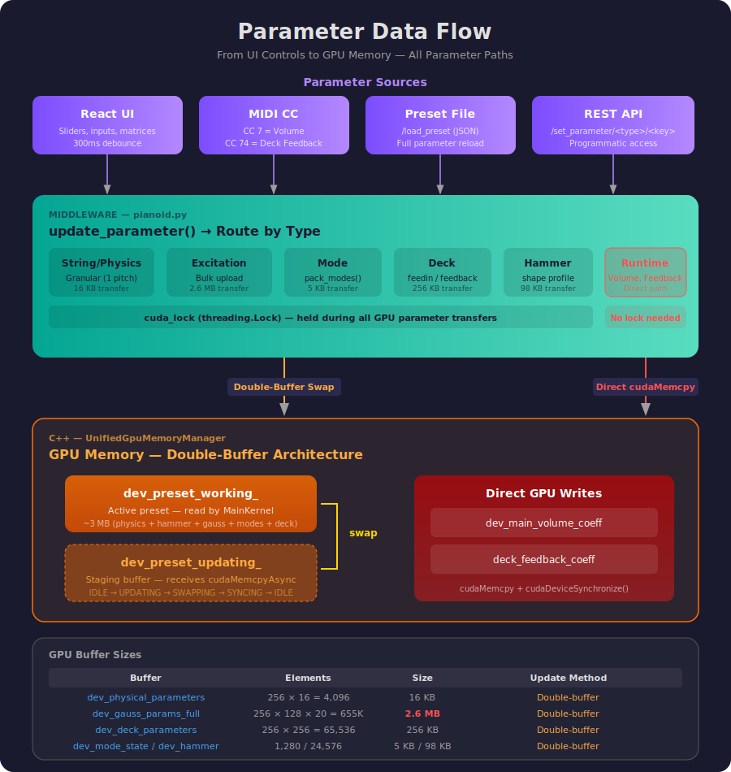

# Data Flows

End-to-end traces for the three major data flows in Pianoid: playback, parameters, and charts/actions. Every function name, endpoint, and class method is verified against the source code.



---

## 1. Playback Flows

### 1.1 Engine Startup (Preset Load → GPU Ready → Playback Active)

```
Browser: POST /load_preset
  { path, listen_to_midi, audio_driver_type, sample_rate,
    audio_buffer_size, array_size, volume, max_volume, start_right_away }
         │
         ▼
backendserver.py: load_preset_route()
  ─► pianoid.destroyPianoid()                    // tear down previous instance
  ─► initialize(path, filterlen, **kwargs)       // pianoid.py:2290
         │
         ▼
pianoid.py: initialize()
  1. json.load(preset_file)                      // read preset JSON
  2. scale geometry if array_size != preset native // main & tail * (new/old)
  3. Pianoid(preset=dict, ...)                    // build StringMap, ModeMap
  3. init_pianoid(...)                            // pianoid.py:1515
     ├── sm.pack_parameters()                    // pack all 256 strings
     ├── pianoidCuda.Pianoid(strings, init_params) // C++ object
     ├── pianoid.devMemoryInit(state, fir, ...)  // allocate ~180 MB GPU
     ├── pianoid.loadPresetToLibrary(phys, hammer, gauss, modes, deck, vol)
     ├── pianoid.switchPreset("default", False)  // activate preset
     ├── pianoid.initParameters()                // finalize kernel args
     └── pianoid.setRuntimeParameters(level=64)  // default volume
  State: UNINITIALIZED → PARAMETERS_LOADED
         │
         ▼  (if start_right_away == 1)
threading.Thread → long_running_procedure()
  ─► pianoid.start_realtime_playback(with_midi_listener)
      ─► start_realtime_playback_unified()       // pianoid.py:980
          1. Create RealTimeEventBuffer()
          2. Create PlaybackConfig(sample_rate, samples_per_cycle, audio=True)
          3. Create OnlinePlaybackEngine()
          4. engine.initialize(pianoid_cpp, config)
          5. engine.setRealTimeBuffer(realtime_buffer)
          6. Thread → engine.run()               // C++ audio loop starts
          7. If listen: start_midi_listener_unified()
  State: PARAMETERS_LOADED → PLAYBACK_ACTIVE
```

### 1.2 Online Playback — MIDI Hardware Device

```
MIDI Controller (keyboard)
  │ rtmidi port 0
  ▼
MidiListener (pianoidMidiListener.py)
  listener.get_message() → [status, data1, data2]
  │
  ├── status=144, vel>0 (NOTE_ON)
  │   └► pianoid.add_realtime_event(NOTE_ON, pitch, velocity)
  │
  ├── status=128 or vel=0 (NOTE_OFF)
  │   └► pianoid.add_realtime_event(NOTE_OFF, pitch, 0)
  │
  ├── status=176, data1=64 (SUSTAIN PEDAL)
  │   └► pianoid.add_realtime_event(SUSTAIN, pedal_value, 0)
  │
  ├── CC 7 (MAIN VOLUME)
  │   └► pianoid.set_volume_level(velocity)
  │       └► pianoid.setRuntimeParameters(RuntimeParameters(level))
  │           └► cudaMemcpy → dev_main_volume_coeff
  │
  └── CC 74 (DECK FEEDBACK)
      └► pianoid.set_deck_feedback_coefficient(coeff)
          exp mapping: CC=64→1.0, CC=127→8.0, CC=0→0.125
```

**Event scheduling** (`add_realtime_event`, pianoid.py:1111):

```
add_realtime_event(event_type, data1, data2, delay_ms=0)
  │
  ├── estimator = engine.getCycleEstimator()
  ├── target_cycle = estimator.getCurrentCycle() + 1
  │     (or estimator.predictCycleForDelay(delay_ms) if delay > 0)
  ├── event = PlaybackEvent(type, channel, data=(pitch<<8)|velocity)
  └── realtime_buffer.pushEvent(event, target_cycle)
        │ std::mutex lock, O(log n) multimap insert, < 1 µs
        ▼
  OnlinePlaybackEngine.run() loop (C++):
    each cycle:
      events = realtime_buffer.drainEventsUpTo(current_cycle)
      for event in events:
        EventDispatcher.dispatch(event)
          │
          ├── NOTE_ON  → exciteStringsForPitch(pianoid, pitch, velocity)
          │                → beginStringBatch()
          │                → addStringToBatch(stringNo, velocity)  × N strings
          │                → commitStringBatch()
          │                    → cudaMemcpy batch indices to GPU
          │                    → set new_notes_ind (arms gaussKernel)
          │                → next executeSynthesisCycle():
          │                    gaussKernel computes force_function from
          │                    dev_gauss_params_full[string][velocity]
          ├── NOTE_OFF → releaseStrings(indices)
          └── SUSTAIN  → processSustain(pedal_value)
      │
      PlaybackCycleExecutor.executeCycle(pianoid, record_audio):
        1. pianoid->executeSynthesisCycle()   → MainKernel GPU launch
        2. pianoid->manageSoundBuffers()      → push to ring buffer
        3. pianoid->recordCycleAudio()        → D2H copy (if recording)
      │
      ▼
  AudioDriver callback → LockFreeCircularBuffer → PCM to OS audio
```

### 1.3 Online Playback — REST API Note Trigger

```
Browser: POST /play { pitch: 60, velocity: 100, command: 144, delay_ms: 0 }
         │
         ▼
backendserver.py: (line 698)
  Maps command → EventType (144→NOTE_ON, 128→NOTE_OFF, 176+pitch64→SUSTAIN)
  ─► pianoid.add_realtime_event(event_type, pitch, velocity, delay_ms)
      │
      ▼  (same path as 1.2 event scheduling)
```

### 1.4 Online MIDI File Playback

```
Browser: POST /midi_playback { action: "start", midi_file: "elise.mid", start_delay_ms: 500 }
         │
         ▼
backendserver.py: midi_playback_route() (line 883)
  ─► pianoid.load_midi_for_online_playback(midi_file, start_delay_ms)
      │                                              pianoid.py:1240
      ▼
  1. MidiRecord().read_midi(midi_file, sustain=True)   // parse MIDI bytes
  2. estimator.getCurrentCycle()                        // current engine cycle
  3. start_offset = int(delay_ms/1000 * sample_rate / samples_per_cycle)
  4. For each MIDI event:
     ├── sample_offset = int(timing_ms / 1000 * sample_rate)
     ├── cycle_offset = sample_offset // samples_per_cycle
     ├── target_cycle = base_cycle + start_offset + cycle_offset
     ├── event = PlaybackEvent(type, pitch, velocity)
     └── realtime_buffer.pushEvent(event, target_cycle)
  │
  ▼ Events are processed cycle-by-cycle by the running OnlinePlaybackEngine
    (same path as 1.2 — events dispatched alongside any live MIDI events)

Stop: POST /midi_playback { action: "stop" }
  ─► Drains EventQueue and clears RealTimeEventBuffer
```

### 1.5 Offline Playback (MIDI File → WAV)

```
pianoid.render_midi_offline(midi_file, output_wav, sample_rate, spc)
                                                    pianoid.py:246
         │
         ▼
  1. MidiRecord().read_midi(midi_file, reset=True, sustain=True)
  2. midi_record.pack_for_offline_playback(sample_rate, spc) → event_queue
  3. PlaybackConfig(audio_enabled=False, record_to_buffer=True)
  4. With cuda_lock:
     pianoid_cpp.runOfflinePlayback(event_queue, config)
         │
         ▼  C++ OfflinePlaybackEngine:
     initialize(pianoid*, config) → loadEvents(queue) → run():
       loop until done:
         processEventsAtCycle(cycle)
           EventQueue.getEventsAtCycle(cycle) → EventDispatcher.dispatch()
         PlaybackCycleExecutor.executeCycle(pianoid, record_audio=true)
           1. pianoid->executeSynthesisCycle()    → GPU kernel
           2. pianoid->manageSoundBuffers()       → no audio driver
           3. pianoid->recordCycleAudio()         → D2H copy to buffer
         collectAudio() → recorded_audio_.append()
         cycle++
       return PlaybackStats
  5. pianoid_cpp.getRecordedAudio() → float array
  6. pianoid_cpp.exportAudioToWav(output_wav, audio_data, sample_rate)
```

Also triggered by chart functions:

```
POST /get_chart_test { chartType: "note_playback", pitch: 60, velocity: 80, duration_ms: 500 }
  ─► chartFunctions.play_note_offline_chart_function()
      1. Build EventQueue: NOTE_ON at cycle 0, NOTE_OFF at cycle N
      2. runOfflinePlayback(queue, config)
      3. getRecordedAudio() → ChartArray with waveform + base64 WAV audio
```

### 1.6 Direct Mode Playback

```
Browser: POST /play_mode/<mode_no>
         │
         ▼
backendserver.py (line 797)
  ─► pianoid.play_mode(mode_no, simulation=False, reset=True)
      │                                          pianoid.py:613
      ▼
  1. self.reset()
     ├── pianoid_cpp.resetStringsState()
     ├── send_mode_params_to_CUDA(keep_state=False)
     └── pianoid_cpp.clearRecords()
  2. mode = self.modes.get(mode_no)
  3. mode.set_state(volume * velocity, volume * velocity * handicap)
  4. state = mode.get_state(keep_state=True)
  5. send_mode_params_to_CUDA(updated_modes={mode_no: state})
     ├── modes.pack_modes(updated_modes) → mode_state array
     └── pianoid_cpp.setNewModeParameters(mode_state)
  6. mode.set_state(0, 0)                        // reset Python state
     // TODO: DEBUG — proper mode state extracting needed
  7. time.sleep(length / 1000)                   // blocking wait for synthesis
     // Known workaround: sleep blocks the calling thread while GPU synthesizes.
     // Not suitable for concurrent use; only called from REST endpoint.
  8. get_result_from_pianoid(length)              // fetch audio
  9. return self.result.get_record(1, mode_no)
```

### Playback Flow Summary Diagram

```
┌─────────────────────────────────────────────────────────────────┐
│                       EVENT SOURCES                             │
├──────────┬──────────────┬────────────┬─────────────┬───────────┤
│ MIDI HW  │ REST /play   │ MIDI File  │ /play_mode  │ Offline   │
│ Listener │ (browser)    │ /midi_play │ (direct)    │ render    │
└────┬─────┴──────┬───────┴─────┬──────┴──────┬──────┴─────┬─────┘
     │            │             │             │            │
     ▼            ▼             ▼             ▼            ▼
┌────────────────────────────┐ ┌──────────────────────────────────┐
│   RealTimeEventBuffer      │ │       EventQueue                 │
│   (live events, mutex)     │ │  (pre-scheduled, sorted by cycle)│
└────────────┬───────────────┘ └──────────────┬───────────────────┘
             │                                │
             ▼                                ▼
      ┌──────────────────────────────────────────┐
      │         OnlinePlaybackEngine.run()       │
      │ or      OfflinePlaybackEngine.run()      │
      │                                          │
      │  processEventsAtCycle(cycle):             │
      │    drain both buffers → dispatch events   │
      │  PlaybackCycleExecutor.executeCycle():    │
      │    1. executeSynthesisCycle() → GPU       │
      │    2. manageSoundBuffers()   → ring buf   │
      │    3. recordCycleAudio()     → D2H copy   │
      └──────────────────┬───────────────────────┘
                         │
              ┌──────────┴──────────┐
              ▼                     ▼
      ┌──────────────┐    ┌─────────────────┐
      │ Audio Driver  │    │ Recorded Audio   │
      │ SDL3 / ASIO   │    │ (offline/charts) │
      │ → speakers    │    │ → WAV / base64   │
      └──────────────┘    └─────────────────┘
```

---

## 2. Parameter Flows

### 2.1 String/Physics Parameters (Granular Path)

The granular path updates individual strings without repacking all 256. This is the primary production path for string physics parameters.

```
React: Strings.jsx — user edits tension for pitch 60
         │
         ▼
usePreset hook: changeParametersOfStrings([60], "tension", [350])
  ─► optimistic state update (immediate UI response)
  ─► 300 ms debounce
  ─► axios.post('/set_parameter/string/60', { "tension": 350 })
         │
         ▼
backendserver.py: set_parameter_route("string", "60")        (line 337)
  ─► parse_range(pianoid, "string", "60") → pitches=[60]
  ─► pianoid.update_parameter("string", values, pitches=[60])
         │
         ▼
pianoid.py: update_parameter(param='string')                  (line 2230)
  ─► update_pitch_physical_params_GRANULAR(pitchID=60, **values)
         │                                                    (line 1906)
         ▼
  0. FRONTEND_TO_PYTHON_PARAM_MAP translation    // string_stiffness→jung, etc.
  1. pitch = sm.pitches[60]
  2. pitch.physics.set_params(**values)          // update Python model
  3. string_indices = sm.get_cuda_string_indices(60)  // e.g. [120, 121, 122]
  4. For each string: apply detuning offset
     new_values[i] = value * (1 + i * detuning)
  6. With cuda_lock:
     pianoid_cpp.setNewPhysicalParameters(physical_params, volume_coeffs)
     pianoid_cpp.setNewHammerParameters(hammer)
     pianoid_cpp.setNewExcitationParameters(gauss_params)
         │
         ▼
C++ UnifiedGpuMemoryManager.updateTunableParameter(name, data):
  IDLE → UPDATING:
    cudaMemcpyAsync(host → dev_preset_updating_, update_stream)
  UPDATING → SWAPPING:
    swap dev_preset_working_ ↔ dev_preset_updating_
    updateDerivedPointers()
  SWAPPING → SYNCING → IDLE
         │
         ▼
  Next MainKernel launch reads updated values from dev_preset_working_
```

### 2.2 Excitation Parameters (Base-Levels Path)

Excitation parameters use a base-levels upload path. Python sends only the 5 fixed
velocity levels (indices [0, 31, 63, 95, 127]) per string. C++ interpolates these to
the full 128 velocity levels on the host side before uploading to GPU. This reduces the
Python→C++ transfer by 25× (25,600 vs 655,360 reals) and eliminates the Python-side
matrix recalculation on every parameter update.

```
React: GaussEditor.jsx — user edits Gauss curve for pitch 60
         │
         ▼
usePreset: changeParametersOfExcitation(...)
  ─► axios.post('/set_parameter/gauss/60', { velocity_curves_dict })
         │
         ▼
parameter_manager.update_parameter(param='gauss')
  1. For each pitch in request:
       pitch.excitation.load_from_dict(values)
         → load_from_dict_to_matrix(): write into levels_matrix[level, param, curve]
         → recalculate_excitation_matrix():
             extract 5 base levels (indices [0,31,63,95,127])
             extrapolate() → 128 velocity levels (shape 128×4×5)
             (Python model updated for preset save/read-back;
              the 128-level matrix is NOT sent to GPU)
  2. Single GPU upload (outside loop, with cuda_lock):
     sm.pack_base_excitations()                 // 5 base levels only
       → for each pitch: pack_base_levels() → 5×4×5 = 100 reals
       → concatenate → 256 × 100 = 25,600 reals (100 KB float)
     pianoid_cpp.setNewExcitationBaseLevels(base_levels)
         └── C++ host interpolation: 5 → 128 levels (linear, matching Python extrapolate())
         └── updateTunableParameter("dev_gauss_params_full", full_params)
             └── double-buffer swap (same as 2.1)
```

**C++ interpolation** (`Pianoid::interpolateBaseLevels`): Private helper used by both
`loadPresetToLibrary()` and `setNewExcitationBaseLevels()`. Uses the same segment
boundaries [0, 31, 63, 95, 128] and linear interpolation as Python's `extrapolate()`.
Segment 0 uses denom=30; segments 1–3 use denom=span. The GPU buffer layout and
`gaussKernel` are unchanged.

**Single path for all excitation uploads:** Both init (`loadPresetToLibrary`) and
runtime updates (`setNewExcitationBaseLevels`) accept base levels and interpolate via
`interpolateBaseLevels()`. `setNewExcitationParameters()` has been removed.

**GPU-side consumption:** When a NOTE_ON event arrives, `gaussKernel` reads the
velocity-specific slice from `dev_gauss_params_full` and computes the force function
waveform. See [SYNTHESIS_ENGINE.md — Excitation System](../modules/pianoid-cuda/SYNTHESIS_ENGINE.md#excitation-system).

**Transfer sizes (bulk vs granular):**

| Buffer | Size (reals) | Transfer |
|--------|-------------|----------|
| `dev_physical_parameters` | 256 × 16 = 4,096 | 16 KB |
| `dev_hammer` | 64 × 384 = 24,576 | 98 KB |
| `dev_gauss_params_full` | 256 × 5 × 20 = 25,600 | **100 KB** (+ C++ interpolation to 128 levels) |
| `dev_mode_state` | 64 × 5 = 1,280 | 5 KB |
| `dev_deck_parameters` | 256 × 256 = 65,536 | 256 KB (single matrix mode) |
| `dev_volume_coeff` | 256 | 1 KB |

### 2.3 Mode Parameters

```
React: Mode.jsx — user edits frequency for mode 5
         │
         ▼
usePreset: changeParametersOfModes([5], "frequency", [261.6])
  ─► axios.post('/set_parameter/mode/5', { "frequency": 261.6 })
         │
         ▼
pianoid.update_parameter(param='mode')
  1. mode.update_params(values)
     Piano_mode.fit_params()                     // recompute omega, dec
  2. send_mode_params_to_CUDA(keep_state=True)   // pianoid.py:2081
     ├── modes.pack_modes() → mode_state (1280 reals, ~5 KB)
     └── pianoid_cpp.setNewModeParameters(mode_state)
         └── updateTunableParameter("dev_mode_state", data)
```

### 2.4 Deck (Feedin/Feedback) Matrices

```
React: PitchesModesMatrix.jsx — user edits feedin for pitch 60
         │
         ▼
usePreset: changeFeedInValues(matrix, pitch=60)
  ─► 300 ms debounce
  ─► axios.post('/set_parameter/feedin/60', { values })
         │
         ▼
pianoid.update_parameter(param='feedin')
  1. sm.update_deck(matrix='feedin', pitches=[60], values)
  2. send_deck_params_to_CUDA()                  // pianoid.py:2091
     ├── sm.pack_deck(single_matrix_mode=True) → deck (65536 reals, 256 KB)
     └── pianoid_cpp.setNewDeckParameters(deck)
         └── updateTunableParameter("dev_deck_parameters", data)

Deck updates use /set_parameter/feedin/<key> and /set_parameter/feedback/<key>
exclusively (the legacy /set_deck/<matrix> endpoint was removed).
```

### 2.5 Hammer Shape

```
React: HammerSpatialProperties.jsx — user edits hammer width
         │
         ▼
axios.post('/set_parameter/hammer/60', { width, sharpness })
         │
         ▼
pianoid.update_parameter(param='hammer')
  1. For each pitch in request:
       sm.update_hammer_shape(pitchID=60, **values)
       PianoHammer.calculate_hammer_shape(offset)
         → Gaussian/circular force profile, min 3 grid points
  2. send_hammer_params_to_CUDA()
     sm.pack_hammers()                          // hammer data only
     pianoid_cpp.setNewHammerParameters(hammer)
         └── updateTunableParameter("dev_hammer", data)
             └── double-buffer swap (same as 2.1)

Also: POST /set_hammer_shape/<pitch_no> (backendserver.py:466)
  ─► sm.update_hammer_shape() + send_hammer_params_to_CUDA()
```

### 2.6 Runtime Parameters (Volume, Feedback)

Direct GPU write — no double-buffer swap needed.

```
POST /set_runtime_parameters { volume: 80, feedback: 64 }
         │
         ▼
Volume:
  pianoid.set_volume_level(80)                   // pianoid.py:336
  ─► RuntimeParameters(level=80)
  ─► pianoid_cpp.setRuntimeParameters(params)
      coefficient = max_volume^(80/127)
      cudaMemcpy → dev_main_volume_coeff         // direct write

Feedback:
  pianoid.set_deck_feedback_coefficient(coeff)   // pianoid.py:411
  ─► exponential mapping: CC=64→1.0, CC=127→8.0
  ─► RuntimeParameters.deck_feedback_coefficient = coeff
  ─► pianoid_cpp.setRuntimeParameters(params)

MIDI path: CC 7  → set_volume_level(velocity)
           CC 74 → set_deck_feedback_coefficient(mapped)

Volume formula (applied in GPU kernel):
  soundInt = Sint32(diff_result * max_volume^(volume_level/127))
```

### 2.7 Preset Save and Load

```
SAVE: POST /save_preset { path: "MySave.json" }
         │
         ▼
pianoid.save_preset(path)                        // pianoid.py:2104
  1. sm.pack_for_preset_file(blocks=blockMode)   // serialize all StringMap
  2. modes.pack_modes_for_preset()               // serialize ModeMap
  3. json.dump(preset, file)                     // write to disk
  Note: reads Python model state only, NOT GPU memory

LOAD: POST /load_preset { path, ... }
         │
         ▼
  Full startup sequence (see section 1.1)
  Destroys existing instance → fresh GPU init → load all parameters
```

### 2.8 Parameter Read Path (GET)

```
GET /get_parameter/<type>/<key_no>
         │
         ▼
pianoid.pack_for_interface(type, pitches, modes)
  ├── type="string"  → pitch.physics.pack()      → {tension, string_density, string_radius, string_stiffness, ...}
  ├── type="gauss"   → pitch.excitation → velocity curves dict
  ├── type="mode"    → mode.pack()                → {frequency, decrement, ...}
  ├── type="feedin"  → sm.pack_deck()             → coupling matrix
  ├── type="hammer"  → hammer.pack()              → {shape, width, position}
  └── type="gauss_full" → all 128 velocity levels
  All reads come from Python model (not GPU memory)
```

### Parameter Flow Summary Diagram

```
┌──────────────────────────────────────────────────────────────────┐
│                        PARAMETER SOURCES                         │
├───────────────┬───────────────┬────────────────┬────────────────┤
│ React UI      │ MIDI CC       │ Preset File    │ REST API       │
│ (sliders,     │ (volume,      │ (/load_preset) │ (/set_param)   │
│  inputs)      │  feedback)    │                │                │
└───────┬───────┴───────┬───────┴───────┬────────┴───────┬────────┘
        │               │               │                │
        ▼               ▼               ▼                ▼
┌──────────────────────────────────────────────────────────────────┐
│                   pianoid.py (Middleware)                         │
│                                                                  │
│  update_parameter()  set_volume_level()  init_pianoid()          │
│         │                   │                  │                 │
│    ┌────┴─────┐            │            ┌─────┴─────┐           │
│    ▼          ▼            ▼            ▼           ▼           │
│  Granular   Bulk      Runtime      Full Load   Deck/Mode       │
│  (1 pitch)  (all 256) (direct)    (all buffers) (matrix)       │
└────┬──────────┬───────────┬────────────┬───────────┬────────────┘
     │          │           │            │           │
     ▼          ▼           ▼            ▼           ▼
┌──────────────────────────────────────────────────────────────────┐
│              UnifiedGpuMemoryManager (C++)                        │
│                                                                  │
│  updateTunableParameter()    setRuntimeParameters()              │
│  ┌─────────────────────┐    ┌──────────────────┐                │
│  │ Double-Buffer Swap   │    │ Direct cudaMemcpy │                │
│  │ host → updating buf  │    │ (no swap needed)  │                │
│  │ swap working ↔ upd   │    └──────────────────┘                │
│  │ sync back             │                                       │
│  └─────────────────────┘                                        │
└──────────────────────────────────────────────────────────────────┘
```

---

## 3. Charts and Actions Flows

### 3.1 Chart Registry (Server Startup)

```
backendserver.py module load:
  chart_registry = ChartTypeRegistry()           // ChartRegistry.py
    Opens chart_config.json
    For each entry:
      ct = ChartType(name, label, processing_function, item_type)
      For each param: ct.add_parameter(name, type, label, default, choices)
      registry.register_type(ct)
    Key format: "<item_type>@<name>"  e.g. "chart@sound", "action@filter"
    Total: ~12 chart types + ~7 action types
```

### 3.2 Chart List Discovery

```
Browser: GET /graph_names
         │
         ▼
chart_registry.graph_names_json()
  → [{ name, label, parameters: [{ name, type, label, defaultValue }] }]
chart_registry.action_names_json()
  → same structure for actions
         │
         ▼
Response: { graphs: [...], actions: [...], message: "OK" }
         │
         ▼
React: ChartSelector.jsx fetches on mount
  ─► usePreset.getChartTypes() → populates selector dropdown
```

### 3.3 Chart Generation (End-to-End)

```
Browser: POST /get_chart_test { chartType: "sound", length: 48000, channel: 0 }
         │
         ▼
backendserver.py: get_chart_test_route()                     (line 966)
  1. chart_type = chart_registry.get_type("sound", "chart")
  2. Validate item_type != "action" (return 499 if action)
  3. pianoid.get_chart_for_frontend(chartType=chart_type, **data)
         │
         ▼
pianoid.py: get_chart_for_frontend()                         (line 2278)
  ─► ChartGenerator(self, chartType=ct, length=48000, channel=0)
      │                                          ChartGenerator.py:23
      ▼
  ChartGenerator.__init__():
    self.processing_arguments = chart_type.extract_arguments(**kwargs)
      → type conversion + default fill for each ChartParameter

  ChartGenerator.get_response():                             (line 61)
    1. func = load_function("chartFunctions", ct.processing_function)
       → importlib.import_module("chartFunctions").sound_function
    2. (charts, header, text_fields) = func(pianoid, **args)
    3. form_response(header, text_fields)
       ├── charts.get_data(scaled=False) → (headers, datas, audio_records)
       └── return { data, general_header, text_fields, chart_headers, audio_data }
```

### 3.4 Chart Functions by Type

**Sound waveform** (`sound_function`):
```
sound_function(pianoid, length=48000, channel=0):
  1. pianoid.result.get_sound_from_pianoid(length)
     └► pianoid_cpp.getRawSoundRecord()           // read from circular buffer (last 5s)
     └► reshape to (num_channels, samples)
  2. sound = pianoid.result.get_sound(channel=-1)
  3. Select channel, trim to length
  4. charts = ChartArray()
  5. charts.append_chart("", data)                // ChartData with statistics
  6. charts.create_audio_to_chart('all', sr=48000)
     └► ChartData.create_audio(sr, direct=True)
         → WAV encode → base64 string
  7. return (charts, "Sound record", text_fields)
```

**String shape** (`string_shape_function`):
```
string_shape_function(pianoid, pitch_no=60, string_no=-1):
  1. pianoid.result.get_pianoid_state()
     └► pianoid_cpp.getStringStateBuffer()        // GPU → CPU
  2. Select pitch/string rows from state buffer
  3. charts.append_chart(label, displacement_array)
```

**Offline note playback** (`play_note_offline_chart_function`):
```
play_note_offline_chart_function(pianoid, pitch=60, velocity=80, duration_ms=500):
  1. Build EventQueue: NOTE_ON at cycle 0, NOTE_OFF at cycle N
  2. PlaybackConfig(record_to_buffer=True, audio_enabled=False)
  3. pianoid_cpp.runOfflinePlayback(queue, config)  // full offline render
  4. audio = pianoid_cpp.getRecordedAudio()
  5. charts + base64 WAV audio
```

**Offline MIDI playback** (`offline_midi_playback_function`):
```
Same as offline note but with full MIDI file → EventQueue
```

**Online MIDI chart** (`online_midi_playback_chart_function`):
```
  1. pianoid.load_midi_for_online_playback(file, delay_ms)  // schedule MIDI events
  2. time.sleep((delay_ms + 2000) / 1000)                   // wait for audio
  3. audio = pianoid.result.get_sound(channel=-1)            // read last sound buffer
  4. (no explicit stop — events drain naturally)
```

**Feedin coupling** (`feedin_function`):
```
  sm.pack_deck() → select pitch row → coupling coefficients (no audio)
```

**Mode playback** (`play_mode_chart_function`):
```
  pianoid.play_mode(mode_index) → get_result_from_pianoid() → waveform
```

**Volume test** (`test_volume_parameters_function`):
```
  coefficients = [max_volume^(level/127) for level in range(128)]
  → volume curve chart (no audio)
```

**Profiling data** (`profiling_data_function`):
```
  pianoid_cpp profiling API → timing counters → chart
```

### 3.5 Action Execution

```
Browser: POST /start_test { action_type: "filter", toggle: true, file: "Bluthner.fir" }
         │
         ▼
backendserver.py: start_test_route()                         (line 997)
  1. action_type = chart_registry.get_type("filter", "action")
  2. pianoid.perform_frontend_command(action_type=at, **data)
         │
         ▼
pianoid.py: perform_frontend_command()                       (line 2283)
  ─► ActionPerformer(self, action_type=at, **kwargs)
      │                                          ChartGenerator.py:72
      ▼
  ActionPerformer.execute():                                 (line 104)
    1. func = load_function("chartFunctions", at.processing_function)
    2. message = func(pianoid, **args)
    3. return message or "OK"
```

**Action functions:**

| Action | Function | What it does |
|--------|----------|-------------|
| `filter` | `filter_action` | `pianoid_cpp.loadFirFilterFromFile(file)` + `enableFirFilter(True/False)` |
| `live_play` | `toggle_engine_action` | Toggle `start_realtime_playback()` / `stop_realtime_playback()` |
| `play_note_offline` | `play_note_offline_action` | Build EventQueue → `runOfflinePlayback()` → `exportAudioToWav()` |
| `online_midi` | `online_midi_playback_action` | `load_midi_for_online_playback()` or `stop_online_midi_playback()` |
| `sinewave` | `sinewave_test_action` | Run sinewave audio test |
| `audio_driver` | `audio_driver_test_action` | Test audio driver |
| `profiling` | `profiling_action` | Start/stop CUDA profiling |
| `add_chart_type` | `add_new_type_action` | Register new `ChartType` → persist to `chart_config.json` |
| `add_action_type` | `add_new_type_action` | Same, with `item_type="action"` |

### 3.6 Data Capture

```
Browser: POST /capture
         │
         ▼
backendserver.py (line 961)
  ─► pianoid.get_result_from_pianoid(length, clear=True)
      │                                          pianoid.py:749
      ▼
  1. pianoid_cpp.clearRecords()                  // clear C++ buffer
  2. time.sleep(length / 1000)                   // accumulate data
  3. self.result.fetch(length, debug)            // pull from C++
     ├── result.get_sound() → audio samples
     └── result.string_states → state arrays
  4. sm.unpack_blocks(result.string_states)      // distribute to model
         │
         ▼
  Data now available for subsequent chart requests:
    pianoid.result.get_sound(channel)
    pianoid.result.string_states
    pianoid.result.get_record(record_no, channel)
```

### Charts and Actions Summary Diagram

```
┌─────────────────────────────────────────────────────────────────┐
│                      React Frontend                             │
│  ChartSelector.jsx ─► GET /graph_names ─► dropdown populated   │
│  User selects chart type + parameters                           │
│  ─► POST /get_chart_test { chartType, params... }               │
│  ─► POST /start_test { action_type, params... }                 │
└────────────────────────────┬────────────────────────────────────┘
                             │
                             ▼
┌─────────────────────────────────────────────────────────────────┐
│                    Flask Router                                  │
│  /get_chart_test → ChartGenerator          (charts)             │
│  /start_test     → ActionPerformer         (actions)            │
│  /capture        → get_result_from_pianoid (data acquisition)   │
└───────────────┬─────────────────────────────┬───────────────────┘
                │                             │
                ▼                             ▼
┌───────────────────────────┐  ┌─────────────────────────────────┐
│    ChartGenerator          │  │    ActionPerformer               │
│                            │  │                                  │
│ 1. chart_registry.get_type │  │ 1. chart_registry.get_type       │
│ 2. extract_arguments()     │  │ 2. extract_arguments()           │
│ 3. load_function()         │  │ 3. load_function()               │
│ 4. func(pianoid, **args)   │  │ 4. func(pianoid, **args)         │
│ 5. form_response()         │  │ 5. return message                │
└───────────┬───────────────┘  └───────────────┬─────────────────┘
            │                                  │
            ▼                                  ▼
┌─────────────────────────────────────────────────────────────────┐
│                    chartFunctions.py                             │
│                                                                  │
│  CHART functions:              ACTION functions:                 │
│  ├── sound_function            ├── filter_action                │
│  ├── string_shape_function     ├── toggle_engine_action         │
│  ├── feedin_function           ├── play_note_offline_action     │
│  ├── play_note_offline_chart   ├── online_midi_playback_action  │
│  ├── play_mode_chart_function  ├── sinewave_test_action         │
│  ├── online_midi_chart         ├── profiling_action             │
│  ├── volume_test_function      └── add_new_type_action          │
│  └── profiling_data_function                                    │
└───────────────────────────┬─────────────────────────────────────┘
                            │
              ┌─────────────┴─────────────┐
              ▼                           ▼
┌──────────────────────┐     ┌────────────────────────┐
│ Data from GPU/Engine  │     │ Side effects           │
│ ├── getSoundBuffer()  │     │ ├── loadFirFilter()    │
│ ├── getStringState()  │     │ ├── start/stop engine  │
│ ├── runOffline()      │     │ ├── runOffline+export  │
│ └── getRecordedAudio()│     │ └── register new type  │
└──────────┬───────────┘     └────────────────────────┘
           │
           ▼
┌──────────────────────┐
│ Response to Frontend  │
│ {                     │
│   data: [[float]]     │
│   chart_headers: []   │
│   general_header: ""  │
│   text_fields: {}     │
│   audio_data: [b64]   │
│ }                     │
└──────────────────────┘
```

---

## Thread Safety Model

| Thread | Role | Synchronization |
|--------|------|----------------|
| Flask HTTP | REST endpoints, parameter writes | `cuda_lock` (Python `threading.Lock`) |
| Engine | `OnlinePlaybackEngine.run()` loop | Reads `RealTimeEventBuffer` via `std::mutex` |
| Audio callback | ASIO/SDL pulls from ring buffer | `LockFreeCircularBuffer` (lock-free) |
| MIDI listener | Pushes events to `RealTimeEventBuffer` | `std::mutex`, < 1 µs |

```
Flask thread ──cuda_lock──► parameter writes to GPU
                            (no conflict with engine reads:
                             double-buffer ensures atomic swap)

MIDI thread ──std::mutex──► RealTimeEventBuffer ──drain──► Engine thread

Engine thread ──push──► LockFreeCircularBuffer ──pull──► Audio callback
```
