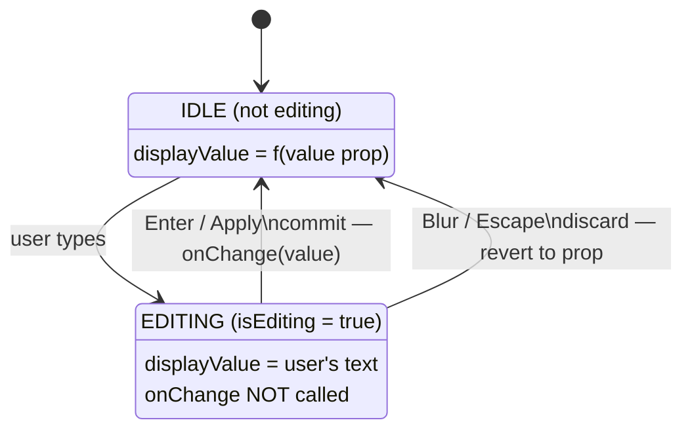

# Digital Input Component — Bidirectional Data Flow Analysis

> **Reconciled 2026-05-17 by dev-cursor-drift.** This doc was first written
> 2026-03-25 against `NumInput.js` commit `c6701a4`. Two reworks have landed
> since: `PianoidTunner@d27770a` (2026-04-22, caret-restore refactor) and the
> `feature/cursor-drift-fix` branch (2026-05-17 — collapsed the three competing
> caret-restore mechanisms to one and added digit-anchored exponent-caret math).
> The "Cursor Position Drift" section below has been rewritten to the post-fix
> truth; the older stale narrative was removed. The fresh deep investigation
> that drove the fix is archived at
> `docs/proposals/archive/cursor-drift-analysis-2026-05-17.md`.

## Problem Statement

The digital input components (primarily `NumInput`) work correctly in sandbox mode (frontend-only, no backend), but fail when connected to the live backend with bidirectional data flow. This document traces the root causes and records fixes applied.

---

## Components in Scope

| Component | File | Role |
|-----------|------|------|
| **NumInput** | `src/components/NumInput/NumInput.js` | Primary numeric editor (1537 LOC), deferred-commit pattern |
| **Strings** | `src/components/Strings.jsx` | String parameter grid, consumes NumInput |
| **usePreset** | `src/hooks/usePreset.js` | Data layer — optimistic updates + debounced API calls |

> `PropertyInput.jsx` (the slider + number reactive component) was **deleted**
> by dev-f259 on 2026-05-02 along with five other dead components — see the
> RESOLVED note in `docs/development/reviews/numinput-inventory-2026-05-01.md`.
> Fix 4 below is retained as a historical record only.

---

## Issues Found and Fixed

### Fix 1: Duplicate useEffect (Critical) — DONE

Two `useEffect` hooks watched the same deps `[value, isExponential, internalDecPlaces]`. The first unconditionally reset `isEditing=false`, destroying the guard that prevented external prop updates from overwriting in-progress edits. Merged into a single effect that respects `isEditing`.

### Fix 2: Stale Closure in Debounced Callbacks — DONE

All `isUpdating*` state flags in `usePreset.js` were captured from first render inside debounced functions stored in refs. Converted all 10 flags to `useRef` so closures always read current values.

### Fix 3: onBlur Behavior — DONE (kept as discard)

Commit-on-blur was attempted but exposed a pre-existing race condition: `Strings.handleValueChange` drops the parameter key, so the parent uses `selectedParameter` from React state. When blur fires after clicking another cell, `selectedParameter` has already changed, causing cross-parameter contamination. Reverted to safe discard-on-blur.

**Prerequisite for commit-on-blur:** The parent (`PianoidTuner.handleValueChange`) must accept a parameter-key override so the value is routed to the correct parameter regardless of selection state.

### Fix 4: PropertyInput Local State Buffer — DONE

Added `useState` + `useRef(isDragging)` local buffer. The slider uses `localValue` that only syncs from the parent `value` prop when not actively dragging, preventing jitter from parent re-renders.

### Fix 5: Read-Back After POST — DONE

`changeParametersOfStrings` now reads back the first updated pitch after all POSTs complete, logging any divergence between the optimistic value and what the backend actually applied.

### Fix 6: Exponential Step Calculation — DONE

`getStepFromCursorPosition()` was gated on `isExponential` state being `true`. But values like `3.1963e-14` display in exponential format via `forceExp` (auto-detect for `< 1e-6`), not from `isExponential` state (which defaults to `false`). The step function skipped its mantissa-aware math and fell through to the decimal calculator, producing a step of `~0.0001` for a value of `3e-14`. Fixed by checking the display string for "e"/"E" instead of the state flag.

### Fix 7: Number.EPSILON Comparison — DONE

The exponential equivalence check used `Math.abs(a - b) < Number.EPSILON`, which is wrong for very small numbers (e.g., `3e-14` vs `5e-14` are both "equal" to EPSILON). Replaced with relative comparison `absDiff / magnitude < 1e-10`.

---

## Cursor Position Drift — RESOLVED (2026-05-17, `feature/cursor-drift-fix`)

**Status:** Resolved. Single caret-restore mechanism + digit-anchored exponent caret.

### Original problem

When arrow keys or the scroll wheel were used on a NumInput field, the caret
could drift away from the digit being edited. For exponential fields the caret
landed in the wrong part of the exponent, so subsequent steps changed the wrong
power of ten.

### Root cause (as finally diagnosed)

React's controlled-input pattern resets the caret to end-of-string whenever
`setDisplayValue(newString)` re-renders the `<input>`. An arrow step triggers
**two** commits — one from `setDisplayValue`, one from the parent re-rendering
after `onChange`. The original code tried to fix this with **three** competing
caret-restore mechanisms — a `useLayoutEffect`, a legacy `setTimeout`-based
`preserveCursorPosition`, and (after `d27770a`) a `requestAnimationFrame` inside
`scheduleCursorRestore`. They fired at different times relative to the React
commit; whichever ran last won, which is the structural fragility behind
"drift under rapid input". Separately, the exponent-step path saved the caret
as a **raw character offset**: when an exponent digit rolled over (`e+9` →
`e+10`) the display string changed length, so re-applying the same integer
offset put the caret on a different logical digit.

### The fix

1. **One caret-restore mechanism.** The legacy `setTimeout`
   `preserveCursorPosition`, the inline `setTimeout` in `handleInputChange`, and
   the `requestAnimationFrame` half of `scheduleCursorRestore` were all removed.
   The single `useLayoutEffect` is now the **sole** writer of the post-render
   caret — it runs synchronously after *every* commit (including the parent
   re-render), so it alone correctly survives the two-commit step sequence.
   `scheduleCursorRestore` is now a one-line `pendingCursorRef` setter.
2. **Digit-anchored exponent caret.** New helper `anchorExponentCaret(oldDisplay,
   newDisplay, oldCaret)` recomputes the caret offset so it stays on the same
   exponent digit *counted from the end of the exponent's numeric part* — the
   digit the next step is meant to act on — even when a rollover changes the
   string length. It is applied at all four exponent-step sites (wheel,
   ArrowUp/Down, ▲ button, ▼ button).
3. **Regression test.** `src/components/__tests__/numinput-cursor.test.jsx`
   (5 tests) covers decimal-field caret stability, exponential-field caret
   stability across a `9 → 10` exponent rollover, and no-drift when a debounced
   parent re-render arrives after a step.

This satisfies **P1 (Separation of Authority)** from `CODE_QUALITY.md` — the
caret position now has exactly one writer (`useLayoutEffect` reading
`pendingCursorRef`) instead of three racing writers.

`pendingCursorRef` is still cleared only by deliberate user actions (typing,
click, blur, Enter/Escape, native arrow/Home/End navigation), so a programmatic
restore never fights a genuine user caret move.

---

## Architecture Notes

### NumInput State Machine



Arrow / wheel steps do not enter the EDITING state — they commit immediately via
`onChange` and arm `pendingCursorRef` for the single `useLayoutEffect` to restore
the caret after the resulting re-renders.

### Data Flow: User → Engine

```
NumInput (Enter/Apply)
  → onChange(value)
    → Strings.handleValueChange(key, value) → drops key, passes only value
      → PianoidTuner.handleValueChange(value) → uses selectedParameter from state
        → stringsHistory.applyChange(changeInfo)
          → usePreset.changeParametersOfStrings(pitches, paramName, values)
            → setParametersOfStrings(optimistic)
            → debounced POST /set_parameter/string/{pitch}
```

### Why Sandbox Works But Connected Fails

In sandbox mode: no backend → `value` prop only changes on user commit → effects never fire mid-edit → no concurrent responses → no parent re-renders during stepping.

Connected mode: backend responses, health polls, and sibling state changes cause external prop mutations that trigger effects and re-renders during active editing.
