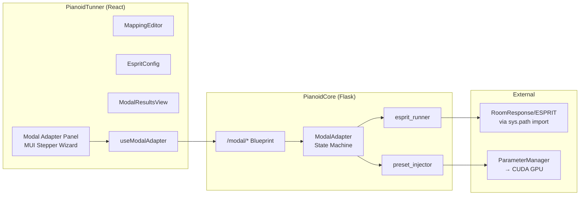

# Modal Adapter — Phase 1 Implementation Plan

**Status:** Implemented. Skeleton works (state machine, REST endpoints, wizard UI) but pipeline produces unusable presets — feedin is uniform, sound output pitches zeroed, no MAC merging, no mode tracking. Superseded by [MODAL_ADAPTER_PIPELINE_PLAN.md](MODAL_ADAPTER_PIPELINE_PLAN.md) for the full rebuild.

Integrate RoomResponse ESPRIT modal extraction into Pianoid as a UI-managed module. Takes raw measurement data, extracts modes, and applies them to the active preset.

---

## Architecture



---

## UI Panel Design — 6-Step Wizard

| Step | Title | Controls | Backend Endpoint |
|------|-------|----------|-----------------|
| 1 | **Load Measurements** | Folder path input or file picker for .npy impulse responses; sample rate display; detected channel/point count | `POST /modal/load_folder` or `POST /modal/upload_measurements` |
| 2 | **Define Mapping** | Two editable tables: (A) excitation point → MIDI pitch, (B) response channel → sound channel. Auto-fill button: "Sequential from pitch __ step __". Skip-channel checkboxes for force channels | `POST /modal/mapping` |
| 3 | **ESPRIT Parameters** | Editable band table (f_min, f_max, filter_order, decimation, exp_factor), model order slider (10-100), frequency range inputs, use_gpu checkbox, max_damping input. Advanced toggle for window length | `POST /modal/run_esprit` |
| 4 | **Run Extraction** | Run button, progress bar (current point / total), cancel button, log output | `GET /modal/status` (polling) |
| 5 | **Review Results** | Mode table (freq, damping, select/deselect), mode shapes heatmap (modes × channels), singular value plot | `GET /modal/results` |
| 6 | **Apply to Preset** | Apply button, merge vs replace toggle, preview: current mode count → new mode count | `POST /modal/apply_to_preset` |

---

## REST Endpoints

| Method | Path | Request | Response |
|--------|------|---------|----------|
| `POST` | `/modal/load_folder` | `{path: "..."}` | `{excitation_points, channels, sample_rate, files}` |
| `POST` | `/modal/upload_measurements` | multipart .npy + sample_rate | Same as above |
| `GET` | `/modal/measurement_info` | — | `{excitation_points, channels, sample_rate, file_list}` |
| `POST` | `/modal/mapping` | `{excitation_to_pitch: {0:21, ...}, channel_to_sound: {0:0, ...}, skipped_channels: [2]}` | `{message: "OK"}` |
| `POST` | `/modal/run_esprit` | `{bands: [...], model_order: 30, freq_range: [30,5000], use_gpu: true, use_tls: true}` | `{task_id: "..."}` |
| `GET` | `/modal/status` | — | `{state, progress, current_point, total_points, message}` |
| `GET` | `/modal/results` | — | `{modes: [...], mode_shapes: [[...]], singular_values: [...]}` |
| `POST` | `/modal/apply_to_preset` | `{selected_modes: [0,1,...], merge: false}` | `{message: "Applied N modes"}` |
| `POST` | `/modal/cancel` | — | `{message: "Cancelled"}` |

---

## Mapping Design

### Excitation Points → Pitches

Each impulse response file was recorded by striking the soundboard at a specific bridge point. Each bridge point corresponds to a piano key (MIDI pitch).

```
Measurement Point 0  →  MIDI 21 (A0)
Measurement Point 1  →  MIDI 23 (B0)
Measurement Point 2  →  MIDI 24 (C1)
...
```

Auto-fill: "Sequential from pitch `21` with step `2`" fills the table automatically.

### Response Channels → Sound Channels

Each accelerometer channel maps to a deck sound channel. Force/calibration channels are skipped.

```
Response Channel 0 (accelerometer 1)  →  Sound Channel 0
Response Channel 1 (accelerometer 2)  →  Sound Channel 1
Response Channel 2 (force sensor)     →  SKIP
Response Channel 3 (accelerometer 3)  →  Sound Channel 2
```

### Data Structure

```python
@dataclass
class MappingConfig:
    excitation_to_pitch: Dict[int, int]   # {point_index: MIDI_pitch}
    channel_to_sound: Dict[int, int]      # {response_channel: sound_channel_index}
    skipped_channels: List[int]           # channels to ignore
```

---

## ESPRIT Integration

### Import Strategy

Import RoomResponse ESPRIT directly via `sys.path` (no code duplication):

```python
ROOMRESPONSE_PATH = os.environ.get('ROOMRESPONSE_PATH', r'D:\repos\RoomResponse')
sys.path.insert(0, os.path.join(ROOMRESPONSE_PATH, 'ESPRIT'))

from esprit_core import esprit_modal_identification, ModalParameters
from band_processing import FrequencyBand, process_multiband, STANDARD_BANDS
```

### User-Configurable Parameters

| Parameter | Default | UI Control |
|-----------|---------|------------|
| Frequency bands | STANDARD_BANDS (4 bands: 30-200, 150-500, 400-1500, 1200-5000 Hz) | Editable table with add/remove rows |
| Model order | 30 | Slider (10-100) |
| Frequency range | (30, 5000) | Two number inputs |
| use_gpu | True | Checkbox |
| use_tls | True | Checkbox |
| use_multichannel | False | Checkbox |
| max_damping | 0.2 | Number input |
| Window length | Auto (signal_length / 2) | Number input (advanced toggle) |

### Processing Flow Per Excitation Point

1. Load multi-channel IR from .npy (shape `(T, n_channels)`)
2. Preprocess: high-pass filter, contact removal
3. For each frequency band: bandpass filter → decimation → ESPRIT
4. Merge modes across bands (deduplicate by frequency proximity)
5. Store per-point `ModalParameters`

### Cross-Point Mode Matching

After processing all excitation points:
1. Cluster frequencies across all points (configurable tolerance)
2. Build global mode list from stable clusters
3. For each global mode: collect amplitude at each excitation point → feedin vector
4. For each global mode: collect amplitude at each response channel → sound channel coefficients

---

## Preset Application

### What Gets Updated

| Component | Source | Method |
|-----------|--------|--------|
| Mode parameters (freq, decrement) | ESPRIT frequencies + `decrement = 2πζ/√(1-ζ²)` | Batch `update_parameter('mode', ...)` → `send_mode_params_to_CUDA()` |
| Feedin/feedback matrices (deck) | Mode shapes at excitation points, mapped via `excitation_to_pitch` | Batch `update_parameter('feedin', ...)` → `send_deck_params_to_CUDA()` |
| Sound channel coefficients | Mode shapes at response channels, mapped via `channel_to_sound` | `update_parameter('sound_channel', ...)` |

### Mode Count Change

If extracted mode count ≠ current preset mode count:
- Cannot do incremental update (CUDA kernel grid is fixed at init)
- Generate full preset JSON (like `create_esprit_preset.py`)
- Use `/preset/load` + `/preset/switch` for atomic double-buffer swap

---

## Data Flow

```
Upload .npy files → Store in temp dir → User defines mapping → User configures ESPRIT
    → Background thread runs ESPRIT per excitation point → Progress polling
    → Cross-point mode clustering → Results displayed in UI
    → User selects modes → preset_injector converts & applies → GPU updated
```

---

## File List

### New Files

| File | Purpose |
|------|---------|
| `PianoidCore/pianoid_middleware/modal_adapter/__init__.py` | Package init |
| `PianoidCore/pianoid_middleware/modal_adapter/modal_adapter.py` | Core state machine: upload → mapping → extraction → results → apply |
| `PianoidCore/pianoid_middleware/modal_adapter/mapping.py` | `MappingConfig` dataclass, validation, auto-fill helpers |
| `PianoidCore/pianoid_middleware/modal_adapter/esprit_runner.py` | ESPRIT import wrapper, per-point analysis, multi-band, progress callbacks |
| `PianoidCore/pianoid_middleware/modal_adapter/preset_injector.py` | Convert ModalParameters + mapping → Pianoid preset modifications |
| `PianoidCore/pianoid_middleware/modal_adapter/routes.py` | Flask Blueprint with `/modal/*` endpoints |
| `PianoidTunner/src/modules/ModalAdapter.jsx` | Main wizard panel (MUI Stepper) |
| `PianoidTunner/src/components/MappingEditor.jsx` | Mapping tables UI |
| `PianoidTunner/src/components/EspritConfig.jsx` | ESPRIT parameters form |
| `PianoidTunner/src/components/ModalResultsView.jsx` | Results table, mode shapes heatmap, singular value plot |
| `PianoidTunner/src/hooks/useModalAdapter.js` | React hook: state, API calls, progress polling |

### Modified Files

| File | Change |
|------|--------|
| `PianoidCore/pianoid_middleware/backendServer.py` | Register Blueprint, add `modal_adapter` global |
| `PianoidTunner/src/PianoidTuner.js` | Add `case "Modal Adapter"` to `renderWindowContent()` |
| `PianoidTunner/src/hooks/useLayout.js` | Add "Modal Adapter" to available panes |
| `PianoidTunner/src/hooks/useWindowManager.js` | Add "Modal Adapter" to window list |

---

## Implementation Sequence

| Order | Task | Dependencies |
|-------|------|-------------|
| 1 | Backend skeleton: `modal_adapter/` package, `mapping.py`, state machine stub | None |
| 2 | `esprit_runner.py`: ESPRIT import, single-point + multi-band, progress | Step 1 |
| 3 | `preset_injector.py`: ModalParameters → preset updates via ParameterManager | Step 1 |
| 4 | `routes.py`: Flask Blueprint with all endpoints | Steps 2, 3 |
| 5 | Register Blueprint in `backendServer.py` | Step 4 |
| 6 | `useModalAdapter.js`: hook with state + API + polling | Step 4 |
| 7 | UI components: `MappingEditor`, `EspritConfig`, `ModalResultsView` | None |
| 8 | `ModalAdapter.jsx`: wizard panel wiring | Steps 6, 7 |
| 9 | Panel integration in `PianoidTuner.js`, `useLayout.js` | Step 8 |
| 10 | End-to-end test: upload data → extract → apply → play | All |

---

## Risks

| Risk | Severity | Mitigation |
|------|----------|-----------|
| ESPRIT runtime (44+ points × 4 bands) | Medium | Background thread + progress polling + cancellation |
| Cross-point mode clustering | Medium | Configurable frequency tolerance; user review of clusters |
| Mode count change requires full reload | Low | Detect mismatch, fall back to preset/load + preset/switch |
| GPU contention (CuPy vs Pianoid CUDA) | Low | Default ESPRIT to CPU; toggle via checkbox |
| scipy dependency | Low | Add to requirements.txt |
| Large file upload | Low | Support server-local path loading (avoids transfer) |
