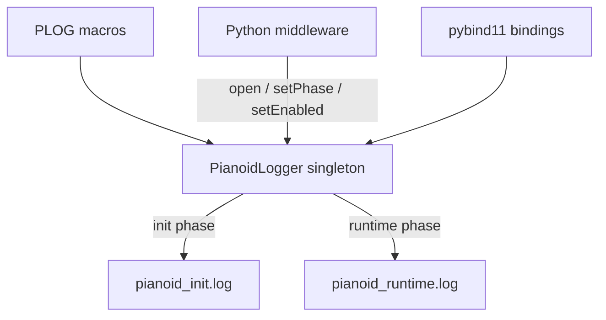

# Logging System

File-based logging for the CUDA synthesis engine. No console output — all messages go to log files. Runtime-switchable with zero overhead when disabled.

---

## Architecture



Two log files separate startup/shutdown output from synthesis-cycle output:

| File | Phase | Content |
|------|-------|---------|
| `logs/pianoid_init.log` | INIT | Constructor, preset loading, parameter setup, driver init, shutdown |
| `logs/pianoid_runtime.log` | RUNTIME | Synthesis cycle warnings, audio callback issues, runtime errors |

---

## PianoidLogger

**File:** `pianoid_cuda/PianoidLogger.h` (header-only singleton)

### Design

- **Atomic enable check** — `std::atomic<bool>` with relaxed ordering. When disabled, cost is a single memory load (no mutex, no fence).
- **Mutex only on write** — `std::mutex` taken only after the atomic check and severity filter pass.
- **Phase routing** — `setPhase()` controls which file `log()` writes to. `logInit()` and `logRuntime()` force a specific file regardless of phase.
- **Severity filter** — `setMinLevel()` filters messages below the threshold.

### API

| Method | Description |
|--------|-------------|
| `instance()` | Returns singleton reference |
| `open(init_path, runtime_path)` | Opens both log files (append mode) |
| `close()` | Flushes and closes both files |
| `setEnabled(bool)` | Runtime switch (atomic) |
| `isEnabled()` | Query enabled state |
| `setMinLevel(LogLevel)` | Set minimum severity filter |
| `setPhase(LogPhase)` | Switch between INIT and RUNTIME log files |
| `log(level, fmt, ...)` | Log to current-phase file |
| `logInit(level, fmt, ...)` | Force to init log |
| `logRuntime(level, fmt, ...)` | Force to runtime log |

### Enums

```cpp
enum class LogLevel { LOG_NORMAL = 0, LOG_WARNING = 1, LOG_ERROR = 2 };
enum class LogPhase { INIT = 0, RUNTIME = 1 };
```

Note: Values are prefixed with `LOG_` to avoid conflicts with Windows preprocessor defines (`ERROR`, `WARNING`).

### Convenience Macros

| Macro | Expands to |
|-------|-----------|
| `PLOG(fmt, ...)` | `log(LOG_NORMAL, ...)` to current-phase file |
| `PLOG_WARN(fmt, ...)` | `log(LOG_WARNING, ...)` — prepends "WARNING: " |
| `PLOG_ERR(fmt, ...)` | `log(LOG_ERROR, ...)` — prepends "ERROR: ", flushes immediately |
| `PLOG_INIT(fmt, ...)` | `logInit(LOG_NORMAL, ...)` — always to init file |
| `PLOG_RUNTIME(fmt, ...)` | `logRuntime(LOG_NORMAL, ...)` — always to runtime file |

---

## Python Integration

### pybind11 Bindings

Exposed in `AddArraysWithCUDA.cpp`:

```python
import pianoidCuda

logger = pianoidCuda.PianoidLogger.instance()
logger.open("logs/pianoid_init.log", "logs/pianoid_runtime.log")
logger.setEnabled(True)
logger.setMinLevel(pianoidCuda.NORMAL)    # NORMAL, WARNING, ERROR
logger.setPhase(pianoidCuda.INIT)          # INIT, RUNTIME
```

### Middleware Lifecycle

In `pianoid.py`:

1. **`init_pianoid()`** — opens log files before the `Pianoid` constructor (captures all init output)
2. **`start_realtime_playback_unified()`** — switches to `RUNTIME` phase
3. **`stop_playback()`** — switches back to `INIT` phase

Log directory: `PianoidCore/logs/` (created automatically, git-ignored).

---

## Migration Status

### C++ Files (Session 1 — complete)

| File | Statements | Category |
|------|-----------|----------|
| `Pianoid.cu` | ~130 | Init (constructor, preset loading, parameter setup) + 1 hot-path fix |
| `Pianoid.cuh` | 4 | Error (template parameter loading) |
| `SDL3AudioDriver.cpp` | ~30 | Init + callback warnings |
| `CircularBuffer.cu` | 5 | Init + CUDA errors |
| `OnlinePlaybackEngine.cu` | 3 | Init/shutdown + errors |
| `PlaybackCycleExecutor.cu` | 1 | Error |
| `CycleTimeEstimator.cu` | 3 | Init (warmup calibration) |

### C++ Files (pending)

| File | ~Statements | Category |
|------|------------|----------|
| `UnifiedGpuMemoryManager.cu` | ~30 | Init (memory allocation) |
| `OfflinePlaybackEngine.cu` | ~26 | Init/shutdown |
| `SinewaveGenerator.cu` | ~5 | Diagnostic |
| `ASIOAudioDriver.cpp` | ~10 | Init |
| `gaussTest.cu` | ~5 | Test |

### Python (planned)

578+ `print()` statements across 27 files. Priority order: `pianoid.py` (156) → `backendServer.py` (79) → `parameter_manager.py` (23) → rest as touched.

---

## Hot-Path Fixes

Three logging statements were identified on the synthesis hot path (firing every cycle or every callback):

| File | Original | Fix |
|------|----------|-----|
| `Pianoid.cu:1934` | `std::cout << "Launchmainkernel..."` every cycle with active notes | Replaced with `PLOG()` (file-only) |
| `SDL3AudioDriver.cpp:207` | `printf("WARNING: SDL3 requested %d chunks...")` per callback | Replaced with `PLOG_WARN()` |
| `CycleTimeEstimator.cu:117` | `std::cout << "Initial calibration..."` during warmup | Replaced with `PLOG_INIT()` |

---

## Related Documentation

- [OVERVIEW.md](OVERVIEW.md) — Module structure and component map
- [PLAYBACK_SYSTEM.md](PLAYBACK_SYSTEM.md) — PlaybackCycleExecutor, phase transitions
- [AUDIO_DRIVERS.md](AUDIO_DRIVERS.md) — SDL3 callback, driver lifecycle
