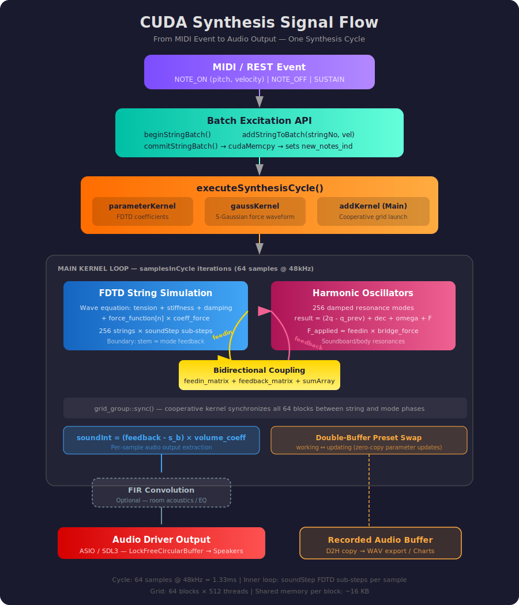

# Synthesis Engine

## Overview

The synthesis engine produces audio by solving the piano string wave equation and the
soundboard mode equations simultaneously on the GPU every synthesis cycle. The two
simulations are bidirectionally coupled: string vibration drives soundboard modes, and
mode displacement feeds back into each string at its bridge termination point.

An optional FIR convolution kernel post-processes the output for room acoustics or
equalization.



---

## Kernel Grid Layout

`addKernel` is launched as a **cooperative grid** (requires `cudaLaunchCooperativeKernel`)
so that `grid_group::sync()` can synchronise all thread blocks between the string and mode
computation phases.

```
Grid layout (cooperative, one launch per synthesis cycle)
=========================================================

  gridDim.x  = numArrays  (= numStrings / numStringsInArray = 256/4 = 64 blocks)
  blockDim.x = 4   (NUM_STRINGS_IN_ARRAY — one dimension for warp-bank layout)
  blockDim.y = 128 (MAX_ARRAY_SIZE / WARP_SIZE — warp-row tiles)

  Thread addressing:
    pointIndex  = threadIdx.y + threadIdx.x * WARP_SIZE   (string spatial point)
    stMdIndex   = threadIdx.y * blockDim.x + threadIdx.x  (mode / quarter index)

  Each block covers:
    - 4 strings packed side by side in shared memory
    - Up to 512 spatial points per string array (MAX_ARRAY_SIZE)
    - 256 modes distributed across blocks via NUM_FOLDS_IN_QUARTER=3 folding

  Shared memory per block (approximate):
    s_a[MAX_ARRAY_SIZE]                  — current string state
    s_mode[MAX_NUM_STRINGS_IN_ARRAY]     — current mode state for block's modes
    s_feedback[MAX_NUM_STRINGS_IN_ARRAY] — accumulated mode→string feedback
    s_force_function[MAX_ITERATIONS_IN_CYCLE × MAX_NUM_STRINGS_IN_ARRAY]
    force_on_bridge_summed[MAX_NUM_STRINGS_IN_ARRAY]
    s_mode_applied_force[NUM_STRINGS_IN_ARRAY]
```

---

## Wave Equation: FDTD String Simulation

Each string is modelled as a 1-D stiff vibrating beam. The finite-difference update for
interior points reads (one sub-step `j` inside the inner loop):

```
target  =  shift_0 * s_a[p]
         + shift_b * s_b                    (previous time step)
         + shift_2 * (s_a[p-2] + s_a[p+2]) (fourth-order spatial stencil — stiffness)
         + shift_1 * (s_a[p-1] + s_a[p+1]) (second-order spatial stencil — tension)
         + coeff_frequency_decay * (d3 - d3_1)  (frequency-dependent damping)
         + s_force_function[n] * coeff_force      (excitation force)
```

Where:
- `s_a[p]` — displacement at point `p`, time `t`
- `s_b`    — displacement at point `p`, time `t - dt`
- `shift_0`, `shift_b`, `shift_1`, `shift_2` — FDTD coefficients derived from tension,
  density, stiffness, and spatial step `dx` (precomputed by `Kernels.cu::parameterKernel`)
- `coeff_frequency_decay` — frequency-dependent damping term (proportional to `coeff_gamma`)
- `coeff_force` — spatial Gaussian profile of the hammer at point `p`
- `d3 = s_a[p-1] + s_a[p+1] - 2*s_a[p]` — second-difference operator

**Boundary condition at the bridge (stem):** The stem points are not integrated with the
wave equation. Instead their displacement is overwritten with the summed mode feedback:

```
if (onStem):  target = feedback   // feedback accumulated from all resonance modes
```

---

## Mode Simulation: Harmonic Oscillator

Each of the 256 resonance modes is a damped harmonic oscillator updated every sub-step.
Per-mode state is stored as five rows in `dev_mode_state`:

```
mode_state[0 * numModes + modeNo]  — current displacement  s_mode
mode_state[1 * numModes + modeNo]  — previous displacement mode_1
mode_state[2 * numModes + modeNo]  — decrement coefficient mode_dec
mode_state[3 * numModes + modeNo]  — omega coefficient     mode_omega
mode_state[4 * numModes + modeNo]  — inverse mass          mode_mass_inv
```

Update equation (one sample per synthesis cycle sub-step):

```
result = ( (2*s_mode - mode_1)
           + mode_1   * mode_dec
           - s_mode   * mode_omega
           + F_applied * mode_mass_inv
         ) * (1 - mode_dec)

mode_1  = s_mode
s_mode  = result
```

Where `F_applied` is the summed force fed into this mode from all strings for the current
sub-step, accumulated via `feedin_cycle_matrix` and reduced with `sumArray()`.

---

## String–Mode Coupling

Coupling is bidirectional: string vibration drives soundboard modes (feedin), and mode
displacement feeds back into each string at its bridge termination point (feedback). Two
intermediate global matrices (`feedin_cycle_matrix`, `feedback_cycle_matrix`) accumulate
contributions from all thread blocks, then `sumArray()` reduces them to per-mode and
per-string scalars. Both matrices are zeroed once per outer iteration (per audio sample),
not per inner FDTD sub-step.

### Coupling Coefficients

Each thread loads coupling coefficients at kernel entry from `mode_coefficients` (the deck
coupling buffer in `PianoidPresetParameters`). A thread covers up to `NUM_FOLDS_IN_QUARTER=3`
mode indices via index folding, so 512 threads per block can address all 256 modes:

```
mode_feedin[i]  = mode_coefficients[stringNo * numModes + modeIndex[i]]
                  (loaded from preset, row-major: string × mode)

mode_feedback[i]:
  USE_SINGLE_DECK_MATRIX=1 (current default):
    mode_feedback[i] = mode_feedin[i] * (*deck_feedback_coeff)
    (feedback derived at runtime from feedin × scalar coefficient)

  USE_SINGLE_DECK_MATRIX=0 (legacy):
    mode_feedback[i] = mode_coefficients[numStrings*numModes + string*numModes + mode]
    (loaded from second half of a 2× larger deck buffer)
```

### Feedin: String → Mode

After the inner FDTD loop, each stem point has accumulated `force_on_bridge_point` across
all `soundStep` sub-steps. The per-string bridge force is summed via `atomicAdd` into
`force_on_bridge_summed[stringInArr]`, then written into `feedin_cycle_matrix`:

```
feedin_cycle_matrix[string * SEGMENT + blockNo] +=
    mode_feedin[i] * force_on_bridge_summed[quarter] / soundStep
```

The `/soundStep` normalises the accumulated force to a per-sub-step average. After a
`grid_group::sync()`, `sumArray()` reduces `SEGMENT_FOR_SHUFFLE_SUMMATION=64` columns to
a single scalar `F_applied` for each mode. The matrix is then zeroed for the next iteration.

### Feedback: Mode → String

At the start of each outer iteration (before the FDTD inner loop), mode displacement is
written into `feedback_cycle_matrix`:

```
feedback_cycle_matrix[string * SEGMENT + blockNo] +=
    mode_feedback[i] * s_mode[quarter]
```

After `grid_group::sync()`, `sumArray()` reduces to one scalar `s_feedback[stringInArr]`
per string. This scalar overwrites the stem boundary points:

```
if (onStem):  target = s_feedback[stringInArr]
```

### Audio Output

The per-sample audio output is computed from the feedback-driven stem displacement:

```
diff_result = feedback - s_b    (stem displacement minus previous)
soundInt[sampleIndex] = Sint32(diff_result * main_volume_coeff)
soundFloat[sampleIndex] = float(diff_result * main_volume_coeff)
```

### sumArray Reduction

`sumArray()` uses a two-level reduction: warp-level `__shfl_down_sync` (32 lanes, ~10
cycles) followed by cross-warp `atomicAdd` into shared memory (~100 cycles). The reduction
is synchronised with `thread_group::sync()` before and after.

### Runtime Feedback Coefficient

`deck_feedback_coeff` is a single `real` in GPU global memory, updated via direct
`cudaMemcpy` + `cudaDeviceSynchronize()` (not double-buffered). Controlled at runtime by
MIDI CC 74 with exponential mapping: `8.0^((CC - 64) / 63)` — CC 0 → 0.125, CC 64 → 1.0,
CC 127 → 8.0. Validation range: 0.0–1000.0.

---

## Synthesis Cycle

One synthesis cycle corresponds to `samplesInCycle` audio samples. The outer loop in
`addKernel` iterates `samplesInCycle` times (up to `MAX_ITERATIONS_IN_CYCLE = 1024`).
Each iteration contains an inner loop of `soundStep` FDTD sub-steps.

```
Per synthesis cycle (managed by Pianoid::executeSynthesisCycle):

  1. Pianoid::launchMainKernel()
       |
       +-- cudaLaunchCooperativeKernel(addKernel, ...)
             |
             for main_cycle_index in [0, samplesInCycle):
               a. Write mode→string feedback into feedback_cycle_matrix
               b. allBlocks.sync()
               c. Reduce feedback for each string (sumArray)
               d. Emit audio sample to soundFloat / soundInt buffers
               e. Inner loop [0, soundStep):
                    - FDTD string update at every spatial point
                    - Accumulate force_on_bridge_point for stem points
               f. allThreads.sync()
               g. Accumulate string→mode force into feedin_cycle_matrix
               h. allBlocks.sync()
               i. Reduce force for each mode (sumArray)
               j. Update harmonic oscillator (mode equation)
               k. Zero feedin_cycle_matrix for next iteration
             |
             Save string_state (current + previous displacement)
             Save mode_state   (current + previous displacement)

  2. Pianoid::playSoundSamples()   — advance excitation cycle index, push to audio driver
  3. Pianoid::appendSoundRecords() — optional D2H copy for recording
```

---

## Signal Flow Diagram

```
  MIDI / REST event
       |
       v
  addStringToBatch() → records string index + velocity into host batch buffers
       |                 (Gauss params already resident on GPU in dev_gauss_params_full)
       v
  commitStringBatch() → cudaMemcpy batch buffers to GPU
       |                  sets new_notes_ind = batch_size + 1
       |
  +----+
  |
  |  +----- executeSynthesisCycle() -----------------------------------------+
  |  |                                                                        |
  |  |  if new_notes_ind > 0:  parameterKernel (update coefficients)         |
  |  |  if new_notes_ind > 1:  gaussKernel (compute force_function)          |
  |  |                                                                        |
  |  |  dev_gauss_params_full ──► gaussKernel ──► dev_force_function          |
  |  |                                                  |                     |
  |  |                                                  v                     |
  |  |  [FDTD string update] <--- string_state (t, t-1)                      |
  |  |        |                    + force_function[n] * coeff_force          |
  |  |        |                                                               |
  |  |  force_on_bridge  -->  feedin_cycle_matrix  -->  sumArray             |
  |  |                                                      |                 |
  |  |                                               F_applied (per mode)    |
  |  |                                                      |                 |
  |  |                                            [harmonic oscillator]      |
  |  |                                                      |                 |
  |  |                                              mode_state (t, t-1)      |
  |  |                                                      |                 |
  |  |                    feedback_cycle_matrix  <----------+                 |
  |  |                           |                                            |
  |  |                        sumArray                                        |
  |  |                           |                                            |
  |  |                     feedback (per string)                              |
  |  |                           |                                            |
  |  |                    [stem displacement = feedback]                      |
  |  |                                                                        |
  |  |  soundFloat / soundInt  <-- (feedback - s_b) * main_volume_coeff      |
  |  |        |                                                               |
  |  +--------+                                                               |
  |           +---------------------------------------------------------------+
  |
  v
  [FIR convolution kernel — optional]
       |
       v
  audio driver (ASIO / SDL3)
```

---

## Excitation System

**Files:** `gaussTest.cu` / `gaussTest.cuh`, `Pianoid.cu`

The excitation system translates MIDI note events into time-varying force waveforms that
drive the FDTD string simulation. It operates in two phases: a **parameter phase** (Gauss
curves uploaded via the double-buffer preset system) and a **trigger phase** (per-note batch
API that launches `gaussKernel` to compute the force function).

### Batch Excitation API

When a note event arrives, the host prepares a batch of strings to excite, then commits
them all in one GPU transfer:

```cpp
void beginStringBatch();
// Reset batch counter (noStrings_in_GP = 0)

void addStringToBatch(int stringNo, int velocity);
// Append one string to the batch:
//   1. Store (stringNo, volume_coeff[stringNo], timing=0) in host buffer
//   2. Compute param_offset = (stringNo * 128 + velocity) * 20
//      into string_gauss_param_indices (index into dev_gauss_params_full)
//   3. Set dec_open[stringNo] = DUMP_OPEN (damper lifted)
//   4. Increment noStrings_in_GP

void commitStringBatch();
// Transfer batch to GPU and arm the kernel trigger:
//   1. cudaMemcpy: string_gauss_param_indices → dev_gauss_param_indices
//   2. cudaMemcpy: string_excitation_params   → dev_string_excitation_params
//   3. Set new_notes_ind = noStrings_in_GP + 1
//   4. Execute pending mode excitation if staged
```

Single-string convenience wrapper:

```cpp
void addOneString(int stringNo, int velocity);
// Equivalent to beginStringBatch() + addStringToBatch() + commitStringBatch()
// for a single string
```

### Kernel Trigger: `new_notes_ind`

`launchMainKernel()` checks `new_notes_ind` to decide which kernels to launch:

```
new_notes_ind == 0  →  addKernel only (normal synthesis cycle)
new_notes_ind == 1  →  parameterKernel + addKernel
new_notes_ind >  1  →  parameterKernel + gaussKernel + addKernel
                        (gaussKernel grid: noStrings = new_notes_ind - 1)
```

`new_notes_ind` is reset to 0 at the end of `launchMainKernel()`.

### gaussKernel — Force Function Computation

**File:** `gaussTest.cu`

`gaussKernel` is a separate kernel (not part of `addKernel`) launched once per note event
to pre-compute the full excitation time series into `dev_force_function`.

```
Launch configuration:
  gridDim  = (noStrings, numSeg)     where numSeg = (mode_iteration * sound_step * 7) / 128
  blockDim = 128
```

For each string in the batch, the kernel:

1. Reads the Gauss parameter offset from `dev_gauss_param_indices[blockIdx.x]`
2. Loads 20 parameters from `dev_gauss_params_full` at that offset:

```
[offset +  0.. 4]  →  mu[5]       (peak time of each Gaussian)
[offset +  5.. 9]  →  sigma[5]    (width of each Gaussian)
[offset + 10..14]  →  g_vol[5]    (amplitude of each Gaussian)
[offset + 15..19]  →  g_shift[5]  (vertical offset / ReLU threshold)
```

3. Computes the force value at each time point using a sum of 5 Gaussians:

```
xCoordinate = sample_index * (EXCITATION_FACTOR - 1) / excitation_length

For each Gaussian i:
    g = exp(-0.5 * ((xCoordinate - mu[i]) / sigma[i])²)
    g = max(g - g_shift[i], 0)      // per-component ReLU gate
    result += g * g_vol[i]

result *= volume_coefficient
```

4. Writes to `dev_force_function[stringNo * totalExcitationLength + sample_index]`

**Note:** The per-component ReLU gate (`max(g - shift, 0)` applied before summation) differs
from the Python `ExcitationParameters.calculate()` method which clips the total sum after
all 5 Gaussians are added. The GPU formula is the one used in actual synthesis.

### Excitation Cycle Index

Each string has an `exct_cycle_index` counter in `dev_exct_cycle_index` (256 ints). When
`gaussKernel` runs, it resets the counter to 0 for each excited string. The main kernel
(`addKernel`) advances this counter each synthesis cycle and reads `force_function` at the
corresponding offset. When the counter exceeds `excitation_factor × num_iterations()`
(default: 8 × 576 = 4,608 sub-steps), the force drops to zero — the hammer has left the string.

### Force Function Buffer

`dev_force_function` is a WORKING-category single-buffered GPU allocation:

```
Size: MAX_NUM_STRINGS × totalExcitationLength reals
      where totalExcitationLength = mode_iteration × sound_step × EXCITATION_FACTOR
      typical: 256 × 4096 = 1,048,576 reals (~4 MB float, ~8 MB double)

Layout (row-major):
  force_function[string_index * totalExcitationLength + sample_index]
```

The buffer is overwritten each time `gaussKernel` runs. Only strings in the current batch
are updated; previously-excited strings retain their force function until the next note event
targeting them.

### Excitation Parameter Storage (Preset Region)

`dev_gauss_params_full` is part of the TUNABLE double-buffered preset block:

```
Size: 256 strings × 128 velocity levels × 20 params = 655,360 reals (2.5 MB float)

Indexing: param_offset = (stringNo * 128 + velocity) * 20

Per velocity level (20 reals):
  [0..4]    mu[5]       — Gaussian peak times (ms within excitation window)
  [5..9]    sigma[5]    — Gaussian widths
  [10..14]  g_vol[5]    — Gaussian amplitudes
  [15..19]  g_shift[5]  — ReLU threshold offsets
```

**Update paths:**

| Path | Method | Transfer | When |
|------|--------|----------|------|
| Init | `setNewExcitationParameters()` | Full 128 levels from Python (655,360 reals) | Once at startup via `loadPresetToLibrary` |
| Runtime | `setNewExcitationBaseLevels()` | 5 base levels from Python (25,600 reals) → C++ interpolates to 128 | Every parameter edit |

`setNewExcitationBaseLevels()` receives the 5 base velocity levels (indices [0, 31, 63,
95, 127]) and performs linear interpolation on the C++ host side to reconstruct the full
128-level buffer. The interpolation uses the same segment boundaries and linear formula
as Python's `extrapolate()`. The reconstructed buffer is then uploaded via
`updateTunableParameter()` on the double-buffer system (see
[MEMORY_MANAGEMENT.md](MEMORY_MANAGEMENT.md)).

### Mode Excitation

Modes can be excited directly (bypassing string-to-mode coupling) via:

```cpp
void addModeExcitation(int modeNo, float displacement, float velocity);
// Stages a direct mode excitation for the next commitStringBatch() call.
// Sets mode state: q = displacement, q_prev = displacement - velocity * dt
// Applied synchronously by commitStringBatch() via _exciteSingleMode().
```

This is used for testing individual resonator modes without triggering string excitation.

### Excitation Constants

| Constant | Value | Meaning |
|----------|-------|---------|
| `NUM_GAUSS` | 5 | Gaussian components per excitation curve |
| `GAUSS_PARAMETERS_NUMBER` | 4 | Parameters per Gaussian (mu, sigma, vol, shift) |
| `LEN_LEVEL_GP` | 20 | Total params per velocity level (5 × 4) |
| `NO_EXCITATION_LEVELS` | 128 | MIDI velocity levels |
| `EXCITATION_FACTOR` | 8 | Excitation duration in milliseconds |
| `MAX_STRINGS_PER_EVENT` | 64 | Max strings per batch |

---

## FIR Filter Convolution

**File:** `FIRFilter.cuh` / `FIRFilter.cu`

`convolutionKernel` is a separate cooperative-grid kernel launched after the main kernel
when `FIRfilterON == true`. It performs per-channel overlap-add convolution:

```
__global__ void convolutionKernel(
    float* input_buffers,      // ring buffer per channel (filterSize + samplesPerCycle)
    const float* input_samples, // raw per-cycle audio
    const float* filters,       // FIR coefficients (inputChannels × outputChannels × filterSize)
    float* output,              // convolved output
    float* partials,            // partial sums [outputChannels × samplesPerCycle][WARP_SIZE]
    float* filter_sums,         // accumulated sums [outputChannels][samplesPerCycle]
    Sint16* int16output,
    float* floatOutput,
    int* cycle_parameters,      // [sampleRate, filterSize, cycle_index, dest_index,
                                //  inputChannelsNo, outputChannelsNo, debugOutputChannel,
                                //  samplesPerCycle]
    const real* main_volume_coeff
)
```

The grid maps `gridDim.x = inputChannels * outputChannels` blocks to input/output channel
pairs, enabling fully parallel multi-channel convolution in a single cooperative launch.

Host wrapper: `runConvolutionKernel()` allocates GPU buffers and returns the convolved
`std::vector<float>`.
