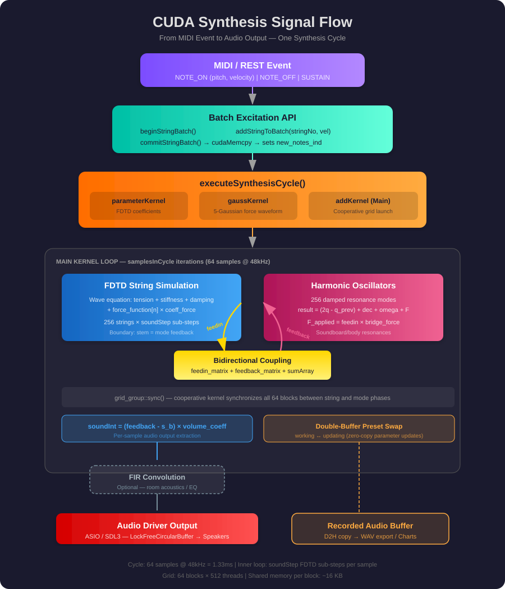

# Synthesis Engine

## Overview

The synthesis engine produces audio by solving the piano string wave equation and the
soundboard mode equations simultaneously on the GPU every synthesis cycle. The two
simulations are bidirectionally coupled: string vibration drives soundboard modes, and
mode displacement feeds back into each string at its bridge termination point.

An optional FIR convolution kernel post-processes the output for room acoustics or
equalization.



---

## Kernel Grid Layout

`addKernel` is launched as a **cooperative grid** (requires `cudaLaunchCooperativeKernel`)
so that `grid_group::sync()` can synchronise all thread blocks between the string and mode
computation phases.

```
Grid layout (cooperative, one launch per synthesis cycle)
=========================================================

  gridDim.x  = numArrays  (= numStrings / numStringsInArray = 256/4 = 64 blocks)
  blockDim.x = 4   (NUM_STRINGS_IN_ARRAY — one dimension for warp-bank layout)
  blockDim.y = 128 (MAX_ARRAY_SIZE / WARP_SIZE — warp-row tiles)

  Thread addressing:
    pointIndex  = threadIdx.y + threadIdx.x * WARP_SIZE   (string spatial point)
    stMdIndex   = threadIdx.y * blockDim.x + threadIdx.x  (mode / quarter index)

  Each block covers:
    - 4 strings packed side by side in shared memory
    - Up to 512 spatial points per string array (MAX_ARRAY_SIZE)
    - 256 modes distributed across blocks via NUM_FOLDS_IN_QUARTER=3 folding

  Shared memory per block (approximate):
    s_a[MAX_ARRAY_SIZE]                  — current string state
    s_mode[MAX_NUM_STRINGS_IN_ARRAY]     — current mode state for block's modes
    s_feedback[MAX_NUM_STRINGS_IN_ARRAY] — accumulated mode→string feedback
    s_force_function[MAX_ITERATIONS_IN_CYCLE × MAX_NUM_STRINGS_IN_ARRAY]
    force_on_bridge_summed[MAX_NUM_STRINGS_IN_ARRAY]
    s_mode_applied_force[NUM_STRINGS_IN_ARRAY]
```

### Mode placement — `ModeLayout.cuh` (4000-modes T1 quarter-fork, dev-624c, 2026-10-10)

Which thread advances which soundboard mode, and which quarter couples it through the deck, is defined in
**one place**: `pianoid_cuda/ModeLayout.cuh` (`makeModeLayout` / `slotMode` / `ownedMode`). The bake
(`stringMapKernel`) writes the per-thread tags into parameter slots **25 / 27 / 28**; `addKernel` reads them
and uses `slotMode` for the feedin row → mode inverse. Notation: `B` = grid blocks (`numArrays`),
`S` = strings per block (4), `Q` = `arraySize / S` (quarter size), `t` = `stMdIndex`, `N` = `numModes`
(`cycle_parameters[2]`, = `num_strings` in practice: 224 Belarus, 232 F15). Mode buffers
(`dev_mode_running`, `dev_mode_state`) stay indexed by the **global** mode number `m`.

| Concept | Before T1 (≤ a92500c) | T1 (dev-624c) |
|---|---|---|
| Coupling slot `(b, k)` = quarter `k` of block `b` — deck feedback scatter over all strings by the quarter's threads; feedin row `r = S·b + k` reduced by block `b` into `s_mode_applied_force[k]` | mode `k·B + b` | **shaped** `k = 0`: mode `b` (`b < B`) · **flat** `k ≥ 1`: mode `B + b·F + (k−1)`, `F = flatPerBlock = ceil((N−B)/B)` (≤ 3) |
| Parameter slot 25 (`modeNo`, per thread) | `B·quarterNumber + blockNo` | `slotMode(b, quarterNumber)` |
| Feedin row `r` → mode (`modeIndexInQuarter`) | `(r % S)·B + r / S` | `slotMode(r / S, r % S)` |
| Oscillator owner (advances `q`, holds `q_prev` in a register) | thread `t = k·Q` (`indexInQuarter == 0`) of each quarter — 4 per block | **explicit per-thread assignment**: shaped mode of block `b` → `t = 0`; flat mode `(b, j)` → `t = Q + j` (flat threads of quarters 1..S−1 numbered contiguously). Slot 27 = owned mode, slot 28 = its coupling slot `k` |
| `q` exchange | `s_mode[quarterNumber]` | `s_mode[ownedSlot]` (owner writes, slot `k`'s quarter reads for the scatter) |
| Flat-mode order on the grid | interleaved (`m = k·B + b`: consecutive modes in consecutive **blocks**) | **block-major** (consecutive flat modes on consecutive threads of one block → coalesced `mode_state` / `mode_running` reads) |
| "No mode" | `modeNo ≥ numModes` | sentinel `numModes` (same guards) |

Shaped tier = quarter 0 = modes `[0, B)` — the lowest modes, one per block (proposal §R.1 Q3). Flat tier =
modes `[B, N)`. **T1 is behaviour-preserving:** every mode keeps its own deck column and equation; only
the thread that runs it moves, so renders differ only by float atomic-order noise
([dev-624c measurements](../../development/mode-scaling-T1-quarter-fork-2026-10-10.md)). **Transitional
constraint:** a flat mode still couples through the deck via slot `k = 1 + j`, so `flatPerBlock ≤ S − 1`,
which holds for `N ≤ B·S = num_strings` (modes beyond `B·S` get no slot — not simulated, exactly as
before). T3 replaces the flat deck coupling by the two uniform reductions and lifts this limit
([proposal §R.2](../../proposals/mode-scaling-4000-implementation-proposal-2026-06-06.md#r2-what-the-decisions-simplify-consequences-derived-from-55-algebra-with-ws-1)).

### Uniform flat tier — `FlatTier.cuh` (4000-modes T3, dev-5bf7, 2026-10-10)

**Opt-in per preset** (`model_parameters.flat_tier_num_shaped` = `nS`, `flat_tier_num_flat` = `nF` →
`InitializationParameters` → `cycle_parameters[13]` / `[14]`; `nF = 0` = the T1 layout above, bit-for-bit the same
code path). With `nF > 0` `makeModeLayout` has three tiers:

| Tier | Modes | Owner thread / slot | Coupling |
|---|---|---|---|
| shaped | `[0, nS)`, `nS ≤ B` (56; F15's 58 blocks → quarter 0 of blocks 56/57 empty) | block `m`, `t = 0`, slot 0 | own deck column (quarter 0), unchanged |
| uniform flat | `[nS, nS + nF)` | flat `f = m − nS`: block `f / U`, `t = Q + f % U`, `U = ceil(nF / B)`; slot `UNIFORM_FLAT_SLOT` (−1) | **no deck slot**: the two reductions below; `q` register-only |
| linked | `[nS + nF, N)` (sound-channel mode slots + padding) | block `b`, `t = Q + U + j`, slot `k = 1 + j` | own deck column via slot `k` (the T1 link), `linkedPerBlock ≤ S − 1` |

**Contract (exactness).** Every packed deck row must be bit-uniform over the flat columns: `deck[s, m] = w(s)` —
enforced by the PianoidBasic packer (`flat_tier.check_uniform_flat_row`, fails the load / edit loudly); the flat gain
`a(m)` is folded into the mode mass by the preset (`mass_inv' = a²·mass_inv`, `q' = a·q`, exact for the linear
recurrence). The kernel reads `w(s)` = deck column `nS` once per launch (`flatDeckWeight`). Then, per audio sample:

| Step | Where (MainKernel loop) | What |
|---|---|---|
| feedback partial | before the loop-top grid sync | warps overlapping the flat owners tree-sum `q'` → shared → thread 0 stores the block's partial in row `numStrings` of `feedback_cycle_matrix`, column = block (plain store, each block owns its column) |
| `Q_sum` | after that grid sync, before the per-string `sumArray` | warp 0 tree-sums the 64 columns → `s_flat[1]`; stems add `fb_scale(s)·w(s)·Q_sum` (`fb_scale` = 1 on output/sound strings, `deck_feedback_coeff` on piano strings — the `mode_feedback` rule) |
| feedin partial | with the per-mode feedin scatter | quarter leaders `w(string_k)·force_k / soundStep` → thread 0 stores the block's sum in row `numStrings` of `feedin_cycle_matrix` |
| `F_sum` | after the feedin grid sync | warp 0 tree-sums → `s_flat[2]`; every uniform owner advances with `F = F_sum` |

No new grid barrier; the cycle matrices gained one row (`(num_strings + 1) × SEGMENT`). Output routing (user
default): an output string's packed row weight is `w_c × SC string gain`, so each channel reads the same `Q_sum`
scaled by its gain. Sums are fp32 trees (same error structure as `sumArray`; a double cross-block stage hit the
128-register cap in the debug variant). Registers: release 111 / debug 114 (sm_89; T1 101 / 103), 0 spill.
Debug readouts of flat `q` are in the folded unit `q'`. Host check: `validateModeLayout` (in `devMemoryInit`)
throws `std::invalid_argument` → `ValueError` if the tiers do not fit the grid. Measurements:
[T3 flat tier](../../development/mode-scaling-T3-flat-tier-2026-10-10.md).

### Register budget & cooperative co-residency pre-flight (dev-1cda, 2026-10-09)

A cooperative launch requires **every** grid block to be resident at once. Runtime geometry:
grid = `num_string_arrays()` (= num_strings / 4; Belarus_8band_196modes 56, F15_Elyashev_array512 58),
block = `array_size` threads (384 or 512), no dynamic smem. On the RTX 4090 one block fits per SM,
so capacity = 1 × 128 SMs ([P0 measurements §2](../../development/mode-scaling-P0-measurements-2026-10-08.md)).

| Layer | Where | What |
|---|---|---|
| Compile-time cap | `MainKernel.cu` `ADDKERNEL_LAUNCH_BOUNDS` = `__launch_bounds__(512, 1)`, **release and debug** | caps registers at 65536/512 = 128/thread → growth spills instead of breaking the launch. Release went 119 → **98** regs (0 spill), debug 99 (unchanged) |
| Build check | `setup.py` + `ptxas_budget.py` | `-Xptxas -v` on every `.cu`; `addKernel` > 128 regs or any spill **fails the build** ([BUILD_SYSTEM](../../architecture/BUILD_SYSTEM.md#register--spill-budget-check--xptxas--v-dev-1cda-2026-10-09)) |
| Init pre-flight | `CoopPreflight.cu` `preflightAddKernel(grid, block, "init")`, first thing in `devMemoryInit` (before any allocation) | `cudaFuncGetAttributes` (loaded binary's regs/smem) + `cudaOccupancyMaxActiveBlocksPerMultiprocessor` × SMs ≥ grid; else throws `CoopLaunchShortageError` → `/load_preset` **500** `coop_launch_shortage` |
| Online pre-flight | `OnlinePlaybackEngine::run`, after `startAudioDriver()` (phase `"online"`) | same check in the device state the launch will see; on shortage the loop does not start, `stats.error_message` carries the reason, the middleware sets `exception` (/health `crashed`, WS lifecycle `ERROR`) |
| Launch backstop | `runSynthesisKernel` (dev-bug1rt FIX-3) | a failed `cudaLaunchCooperativeKernel` returns 500 **and** is recorded (phase `"launch"`) — the occupancy API cannot see SMs taken by other GPU contexts, so this stays the guaranteed catch |

The last report (phase, grid, capacity, blocks/SM, SMs, regs, smem, message) is
`<module>.getCoopOccupancyReport()` and `/health.cooperative_launch`. Each check logs one line,
e.g. `[OCCUPANCY] addKernel(init): regs/thread=98 block=512 smem=18496B maxThreads/block=512 |
SMs=128/128 blocks/SM=1 -> capacity=128 >= grid=58 OK (margin 2.21x)`.
**Test knob:** env `PIANOID_COOP_SM_BUDGET=<n>` (0 < n < device SMs) makes the check use n SMs
— simulates SMs consumed by other GPU work so the shortage path can be exercised on a large GPU
(read on every pre-flight call). `run()` no longer reports `completed_successfully=true` after a
failure (it was unconditionally overwritten before).

---

## Wave Equation: FDTD String Simulation

### Physical model

Each string is modelled as a 1-D stiff vibrating beam with tension, bending stiffness,
velocity damping, and frequency-dependent (high-frequency) damping. The continuous PDE:

```
y_tt = (T/ρ) y_xx − (EI/ρ) y_xxxx − γ y_t − γ_HF · ∂(y_xx)/∂t + F/ρ
```

| Symbol | Meaning |
|--------|---------|
| `y(x,t)` | Transverse displacement |
| `T` | String tension |
| `ρ` | Linear density (per-unit-length mass) |
| `EI` | Bending stiffness (`EI ∝ E · r⁴` — Young's modulus × area moment) |
| `γ` | Velocity damping coefficient |
| `γ_HF` | Frequency-dependent damping (time-derivative of curvature) |
| `F(x,t)` | Applied external force (hammer excitation) |
| `y_xx` | `∂²y/∂x²` (spatial second derivative); `y_xxxx` likewise fourth |

### FDTD discretization

The PDE is solved with an explicit finite-difference scheme. Time is advanced in sub-steps
of `dt = 1 / (sample_rate × string_iteration)` inside the inner loop; space is discretized
on a uniform grid of spacing `dx` (set by string geometry). Each outer iteration produces
one audio sample after `string_iteration` sub-steps.

Interior-point update (one sub-step `j`):

```
target  =  shift_0 * s_a[p]
         + shift_b * s_b                    (previous time step)
         + shift_1 * (s_a[p-1] + s_a[p+1]) (2nd-order stencil — tension)
         + shift_2 * (s_a[p-2] + s_a[p+2]) (4th-order stencil — bending stiffness)
         + coeff_frequency_decay * (d3 - d3_1)  (HF damping — d/dt of curvature)
         + s_force_function[n] * coeff_force    (hammer force, per-point)
```

Where:
- `s_a[p]` — displacement at point `p`, time `t`
- `s_b` — displacement at point `p`, time `t − dt`
- `d3 = s_a[p−1] + s_a[p+1] − 2·s_a[p]` — discrete second-difference (curvature operator)
- `shift_0`, `shift_b`, `shift_1`, `shift_2`, `coeff_force`, `coeff_frequency_decay` —
  per-string FDTD coefficients, precomputed each cycle by `Kernels.cu::parameterKernel`
  (see the scaling table below).
- `s_force_function[n]` is the pre-computed Gaussian-sum force time series
  (see [Excitation System](#excitation-system)); `coeff_force` multiplies it into the
  per-point update and folds in the per-point hammer shape `hammer[p]`.

**Boundary condition at the bridge (stem):** The stem points are not integrated with the
wave equation. Instead their displacement is overwritten with the summed mode feedback:

```
if (onStem):  target = feedback   // feedback accumulated from all resonance modes
```

**Python reference** for both the discretization and coefficient formulas is
`PianoidBasic/Pianoid/Pitch.py::get_coefficients` (line 294). When GPU and Python disagree,
Python is authoritative.

### Coefficient scaling table

`iterPerMs = (sample_rate × string_iteration) / 1000 = 1 / (dt · 1000)`, so `1/iterPerMs²
∝ dt²`. These are the canonical scalings used by `parameterKernel` to produce the update
coefficients above, each traceable to a Python reference formula for GPU↔Python parity audit.

| Coefficient | Physical meaning | Per-sub-step scaling | GPU source | Python reference |
|---|---|---|---|---|
| `coeff_tension` | `(T/ρ) · dt² / dx²` | `∝ dt²` (∝ 1/iter²) | `Kernels.cu:133` | `Pitch.py:307` |
| `coeff_bending` | `(π·E·r⁴ / 4ρ) · dt² / dx⁴` | `∝ dt²` (∝ 1/iter²) | `Kernels.cu:135` | `Pitch.py:310` |
| `coeff_frequency_decay` | HF damping: `γ_HF · 1e12 / (2·dx²) · dt/dt_ref` | `∝ dt` (∝ 1/iter; = legacy value at the reference grid, dev-f2b8) | `Kernels.cu:144` | `Pitch.py:321` (`c2dec ∝ 1/(dt·dx²)` — differs; Python is not the reference for this term) |
| `dec_curr` | `γ_string · dt + damper_string · dump_coeff · dt/dt_ref` (velocity damping; `dump_coeff` = damper step count on the main string, `damper_tail` on the tail — see below) | `∝ dt` (∝ 1/iter; damper term dt-scaled since dev-f2b8) | `Kernels.cu:146` | `Pitch.py:311` |
| `coeff_force` | `dt² · dec_inv · hammer[p]` (per-point force coefficient) | `∝ dt²` (∝ 1/iter²) | `Kernels.cu:155–158` | `Pitch.py:319` (`cf = dt² · dec_inv`) |
| `shift_0` | `(2 + 12·coeff_bending − 2·coeff_tension) · dec_inv` | derived | `Kernels.cu:144` | `Pitch.py:314` |
| `shift_b` | `(dec_curr − 1) · dec_inv` | derived | `Kernels.cu:148` | `Pitch.py:318` |
| `shift_1` | `(coeff_tension − 8·coeff_bending) · dec_inv` | derived | `Kernels.cu:145` | `Pitch.py:315` |
| `shift_2` | `2 · coeff_bending · dec_inv` | derived | `Kernels.cu:146` | `Pitch.py:316` |

`dec_inv = 1 / (1 + dec_curr)`. `dt/dt_ref = REFERENCE_SUBSTEP_RATE / (sample_rate · string_iteration)`,
`REFERENCE_SUBSTEP_RATE = 48000·4` (`constants.h`) — exactly `1.0` on the reference grid, so presets tuned at
48 kHz × 4 are unchanged there.

**Damper multiplier `dump_coeff` (dev-f27f, 2026-10-02).** `dump_coeff` multiplies `damper_string`:

| Points | `dump_coeff` | Values |
|---|---|---|
| main string | `int(pow((127 − sustain) · dumper_position, 0.6))` — integer damper step count | 18 damper closed, 0 open (key held); intermediate with the sustain pedal |
| tail | `damper_tail` (`physical_parameters[14]`) — a **real, dimensionless multiplier** | e.g. 127 (`PhysicalParameters` default, the former constant `DUMP_ON_TAIL`), FPGA converter 1…1e6 |

So the tail decrement is `damper_string · damper_tail · dt/dt_ref`: only the product matters, `damper_tail` is
NOT an absolute damping value (history: PianoidCore 3ad994e `DUMP_ON_TAIL = 127` → 6e0182b slot 14 + PianoidBasic
b7e93d4 default 127). Until dev-f27f `dump_coeff` was an `int`, so `damper_tail` was truncated and every value
< 1 was inert — all stock presets (Belarus family, `BaselinePreset1`, test presets) store `damper_tail ==
damper_string` (3e-6…1.1e-4), measured identical renders for stored / ×1000 / 0. Now it is a `real`: integer
multipliers give bit-identical coefficients (F15_Elyashev_array512: 0 of 950 272 kernel coefficients changed);
stock presets get the tiny tail decrement `damper_string²` ≈ 1e-11…1e-8 (C7 release-part waveform change ≤ 2.6e-3,
level/decay/pitch unchanged — inaudible). A stock preset that wants an audible tail damper sets `damper_tail` to a
multiplier (e.g. 127). Pinned by `tests/integration/test_tail_damper.py`. Evidence
`docs/development/diagnostics/dev-f27f-renders/summary.md`.

`coeff_force` was corrected in commit `6e58413`: previously `∝ dt¹` (in ms units), causing
the per-sample force integral to scale as `iter` and an audio peak that scaled linearly
with `string_iteration`. Current formula matches the Python reference `cf = dt² · dec_inv`
to within 0.3%. See
[VOLUME_ITER_BUG_INVESTIGATION.md](../../development/archive/VOLUME_ITER_BUG_INVESTIGATION.md).

**Note on `coeff_force` interpretation:** it is the per-point force coefficient
`dt² · dec_inv · hammer[p]`, *not* a spatial Gaussian. The Gaussian / circular hammer
profile is in `hammer[p]` (precomputed from `PianoHammer.calculate_hammer_shape()` and
folded into the coefficient by `parameterKernel` at kernel entry).

### Numerical scheme invariants

- **Per sub-step:** FDTD string update, bridge force accumulation. Runs `string_iteration`
  times per audio sample.
- **Per audio sample (outer iteration):** mode ODE update, feedin/feedback reduction,
  `soundFloat` / `soundInt` emission. Runs `samplesInCycle` times per kernel launch.
- **Iter-invariant by design:** audio peak, spectral content. Post-fix validation: peak
  ratio iter=12/iter=4 = 1.011× (target ≤ 1.02×).
- **Excitation impulse must carry `dt` (dev-f2b8, 2026-10-01).** The kernel delivers a strike impulse of
  `coefficient · Σ_k f_k · dt` (gaussKernel writes `coefficient · shape` per sub-step; `coeff_force ∝ dt²`).
  The B2 excitation coefficient (`c·m·v / (temporal·spatial)`, 2026-06) divided by a *bare* point-sum
  `temporal = Σ_k f_k` over `8·mode_iteration·N` sub-steps, i.e. `∝ N` — so the coefficient, the delivered
  impulse and the output level were `∝ 1/N` (−6 dB per doubling of `string_iteration`; measured k = −1.0…−1.3
  on every output path incl. `listen_to_modes`, e.g. Belarus A1 −63.0 → −78.3 dB at N 4 → 16). Fix
  (PianoidBasic `ExcitationParameters.level_impulse`): `temporal = Σ_k f_k · dt / EXCITATION_REFERENCE_DT`,
  reference grid 48 kHz × 4 (every calibrated preset's stored grid → byte-identical there). After: peak
  N-flat (C4/C7 within ≤1.1 dB over N = 2–16); the remaining RMS drift (−2…−3.5 dB, 4 → 16) is the
  decay-rate N-dependence below, not a level-scaling error. Evidence:
  `docs/development/diagnostics/dev-f2b8-renders/summary.md`.
- **Decay is iter-invariant (dev-f2b8, 2026-10-01; was the open "iter-scaled residual").** In the summed
  form the sub-step increment is `Δv = u_tt·dt²`, so a damping term `γ_HF·∂t(u_xx)` contributes
  `γ_HF·dt·(d3 − d3_1)/dx²` and a velocity damping contributes `∝ dt`. `coeff_frequency_decay` and the damper
  term were constant per sub-step (effective damping `∝ string_iteration`); both are now × `dt/dt_ref`. The
  dampers that mattered while a key is HELD are those of the NON-played strings (closed), which drain the
  shared modes. Measured (template + BaselinePreset1, N = 2/4/8/16, velocity/acceleration/listen_to_modes):
  decay spread across N 6–123 % → ≤ 2.4 %; peak and RMS within 0.3 dB (C7 peak 1.3 dB); N = 4 render equal
  to dev within the run-to-run atomicAdd noise. Evidence `docs/development/diagnostics/dev-f2b8-renders/summary.md`
  Part 2. **Changed coefficient semantics (for preset generators, e.g. the FPGA converter):** `disp_decay` and
  `damper_string` now mean their per-sub-step effect AT THE REFERENCE GRID (48 kHz × 4); the engine applies
  `× dt/dt_ref` itself. A generator that folded the GPU/FPGA step ratio `k = dt_g/dt_src` into them must use
  `k_ref = dt_ref/dt_src` instead (N-independent); `damper_tail` (a multiplier on `damper_string`) is unchanged; `gamma` was
  already dt-scaled; the excitation coefficient now delivers the N = 4 impulse at every N.
  History — before the fix, re-measured dev-f2b8 (Belarus template, v110): C7 decay
  −33 → −68 dB/s and C4 −23 → −28 dB/s at N 4 → 16; with `disp_decay = 0` C7 decay is −5.3/−4.7/−4.0
  (N 4/8/16) and the C4/C7 RMS level is N-flat within ≤1.2 dB — i.e. the per-sub-step HF term should
  scale `∝ dt` (anchored at the reference grid). See
  [WORK_IN_PROGRESS.md](../../development/WORK_IN_PROGRESS.md#known-follow-ups).

### Numerical precision: float32 and `string_iteration` (dev-1e95, 2026-10-01)

`real` is **float32** (`pianoid_types.h`, `PIANOID_USE_FLOAT`; the kernel was `double` until
PianoidCore `6a652df`/`36f05fe`, 2025-09-13 "real type"). In exact arithmetic the scheme above is
**independent of `string_iteration`** (a double-precision replica of the full per-sample map — N
sub-steps, stem held at the per-sample feedback, modes — has the same spectral radius and the same
fundamental at N = 4/8/16, measured ρ = 0.9999928 for F_15 MIDI 22; the sample-and-hold bridge
gives *exactly* the same ρ as an every-sub-step coupling). The float32 engine is **not**: the per-sub-step
restoring increment of a bass string is `ω²·dt²·u ≈ 5e-8·u` at 48 kHz × 16 sub-steps (A0),
*below* the ~1e-7·|u| rounding of the three-level update `2u − u_prev + (…)`, so the acceleration is
rounded away and the bass dynamics become rounding-dominated. Measured on the unmodified float engine
(Belarus template, array 384, v110, cents vs 12-TET): pitch 24 = +1.4 / −5.6 / +15.5 / **+90.1** at
N = 4/8/12/16; pitch 29 +4.3 → +42.5; pitch 45 −0.6 → −23.1; F_15 MIDI 22 +18 → +111 c; and with the
12 stiff F_15 bass strings coupled through the modes the rounding drift is amplified into a DC-dominated
runaway (+400…+500 dB/s at N ≥ 12). A double build removes all of it (pitch 24: +2.1/+2.3/+2.5/+2.7)
but costs 1.5–3.5× cycle time (2.0–2.3 ms at N = 16 against the 1.33 ms budget) and fails the
cooperative launch at array 512 (register pressure).

**Fix (float-preserving; PianoidCore `feature/dev-1e95-string-iteration-precision`, pending merge): the
inner loop integrates in summed (position/increment) form.** With
`v = u − u_prev` kept in a register (`s_v`, re-derived from the two stored time levels once per kernel
launch), the identical algebra is

```
dv = c_u·u + shift_1·(u[p−1]+u[p+1]) + shift_2·(u[p−2]+u[p+2]) − dec2·v
     + coeff_frequency_decay·(d3 − d3_1) + s_force_function[n]·coeff_force
v  += dv
u_new = u + v
c_u  = (12·coeff_bending − 2·coeff_tension)·dec_inv   (= shift_0 − 1 + shift_b;  parameters slot 4)
dec2 = 2·dec_curr·dec_inv                           (= 1 + shift_b;            parameters slot 8)
```

The small acceleration is accumulated into the small increment instead of being rounded against
`2u − u_prev`; `c_u`/`dec2` are produced by `parameterKernel` from the small terms directly (slots 4 and 8
were previously an unused `1` and the unread `coeff_E`). The state buffers (`dev_string_state`: current +
previous level), the output derivative (`feedback − s_b`), reset and the amplitude self-heal are unchanged.
Verification surface: offline render sweep over `string_iteration` — pitch must be N-independent and the
F_15 bass must stay stable at N = 16 (the exact FPGA step). Session log: `docs/development/logs/dev-1e95-*.md`.

---

## FDTD Stability (CFL / Courant) Bound

The interior-point update above is an **explicit** finite-difference scheme, so it is only
*conditionally* stable: the per-string coefficients must satisfy a von-Neumann (CFL / Courant)
bound, or the displacement field grows without bound each step → `Inf`/`NaN`. This section
records the **derived, measurement-confirmed** bound. It is the load-bearing fact for any
stability guard on these coefficients (a guard must use the *correct* bound — see the warning
at the end about the historically-drafted `coeff_tension + 4·coeff_bending` form, which is
**wrong**).

### Von-Neumann derivation

Substitute a single Fourier mode `u^n_p = g^n · e^{i θ p}` (θ = `k·dx` ∈ `[0, π]`, `g` the
per-step amplification factor) into the homogeneous update (drop the forcing term — linear
stability). The spatial operators become:

| Stencil term | Fourier image |
|---|---|
| `s_a[p−1] + s_a[p+1]` | `2·cos θ` |
| `s_a[p−2] + s_a[p+2]` | `2·cos 2θ` |
| `d3 = s_a[p−1]+s_a[p+1]−2·s_a[p]` | `−2·(1 − cos θ)` |

This yields a characteristic quadratic in `g`:

```
g² − A(θ)·g − B0(θ) = 0
  A(θ)  = shift_0 + 2·shift_1·cos θ + 2·shift_2·cos 2θ + coeff_frequency_decay·(−2)(1 − cos θ)
  B0(θ) = shift_b + coeff_frequency_decay·2·(1 − cos θ)
```

With the **core** coefficients (velocity damping `dec_curr = 0`, HF damping
`coeff_frequency_decay = 0`): `shift_b = −1`, so `B0 = +1` and the quadratic is
`g² − A·g + 1 = 0`. Its two roots multiply to `1`, so they lie on the unit circle (|g| ≤ 1)
**iff `|A(θ)| ≤ 2`** for every θ. (`|A| > 2` ⇒ real roots, one `> 1` ⇒ exponential blow-up.)

### The bound (closed form, with `B = coeff_bending`, `T = coeff_tension`)

Evaluating the Jury condition at the binding modes gives the **two-sided stability box**:

```
8·coeff_bending  ≤  coeff_tension  ≤  1 + 8·coeff_bending
```

- **Upper edge — the CFL limit:** `coeff_tension − 8·coeff_bending ≤ 1`. The classic
  tension-Courant bound (`coeff_tension ≤ 1` at `B = 0`), *relaxed* by bending stiffness.
  **Binding wavenumber:** as `T → 1⁻` (approaching the upper edge *from below*) the growth onset
  binds at **θ → 0⁺** (long wavelength near DC), **not** θ = π. (An earlier revision of this doc
  stated the binding mode was Nyquist θ = π; that is imprecise — see the lower edge.)
- **Lower edge:** `coeff_tension ≥ 8·coeff_bending` — tension must dominate bending at the grid
  scale. This edge **does** bind at the **Nyquist mode θ = π** (`A(π) = 2 + 32B − 4T`; `T < 8B`
  self-amplifies at π). A real positive-stiffness, large-radius preset can hit it (`B = 2.77e-3,
  T = 0.018` blows up with `|g| = 1.14` even though `T − 8B = −0.004 ≤ 1`).

> **The `(coeff_tension − 8·coeff_bending) / CFL_LIMIT` ratio is a DISPLAY number, not a sufficient
> reject criterion.** It encodes only the **upper** edge, so it **misses** a real lower-edge / bending
> blow-up (the `B = 2.77e-3` case above). A correct gate must test **both** edges — equivalently the
> Jury condition (i) `|B0(θ)| ≤ 1` and (ii) `|A(θ)| ≤ 1 − B0(θ)` over θ, which is exactly
> `max_θ|g(θ)| ≤ 1`. `CFL_LIMIT = 1`; a lossless string sits at `|g| = 1`.

### Damping terms (measured)

| Term | Effect on the bound | Why |
|---|---|---|
| Velocity damping `dec_curr` | **No change** | `A` and `B0` both scale by `dec_inv`, so the `\|g\| ≤ 1` condition is invariant in `dec_curr`. Confirmed: upper edge `T_upper = 1.08` for all `dec_curr ∈ [0, 2]` at `B = 0.01`. |
| HF damping `coeff_frequency_decay` | **Tightens** (lowers the ceiling) | Adds a `−2(1−cosθ)` term to `A`. Confirmed: at `B = 0.01`, `coeff_frequency_decay = 0.1` drops `T_upper` 1.08 → 0.88. ⇒ ignoring it in a guard is *conservative* (the undamped bound is the loosest). |

### Measurement validation

The bound was confirmed by computing the **exact amplification factor** `max_θ |g(θ)|` of the
real scheme coefficients (roots of the characteristic quadratic) — a direct numerical
measurement of stability, not an assertion:

- Along the upper boundary the invariant `(coeff_tension − 8·coeff_bending)` equals
  `1.000000` to 6 digits for `coeff_bending ∈ [0, 0.1]` (the entire physically-relevant range;
  it drifts only at `B ≥ 0.15`, where a higher-order interior-θ term takes over — far outside
  any real preset).
- Boundary crossing at `B = 0`: `coeff_tension = 0.99, 1.00` → `|g| = 1.0` (stable);
  `coeff_tension = 1.01` → `|g| = 1.22` (diverges).
- A 29×19 grid over `(T, B)` matches the analytic box to within boundary-discretisation
  (15 edge cells); the box **is** the stability region.

Derivation + validation scripts: `docs/development/diagnostics/dev-cfl-*.py`
(`dev-cfl-vonneumann-derivation.py`, `dev-cfl-region-map.py`, `dev-cfl-upper-boundary.py`,
`dev-cfl-failure-direction.py`). A live-engine NaN cross-check
(`dev-cfl-live-bound-validation.py`) is staged for the implementation phase (it needs a
clean GPU; the cooperative-grid `addKernel` cannot launch reliably under heavy GPU
contention).

### Real-preset regime, and the `length→dx` regression

For `Belarus_8band_196modes` (88 pitches, via the authoritative
`Pitch.get_coefficients`): `coeff_tension ∈ [0, 0.046]` — a ~20× margin under the upper
CFL edge — and `coeff_bending ∈ [−0.0047, 0]` (this preset stores Young's modulus negative).
The engine normally sits **far from the upper CFL edge**.

The `length→dx` regression (`a558cb3`, fixed in `cce4270`) did **not** fail by exceeding the
upper bound. A wrong-unit `length` made `dx` ~84–196× too **large**; since
`coeff_tension ∝ 1/dx²` and `coeff_bending ∝ 1/dx⁴`, `T` and `B` collapsed toward **0**, where
the recurrence degenerates to `g² − 2g + 1 = 0` — a **defective double root at |g| = 1** that
produces *polynomial* (not exponential) drift: the "noise that grows and persists" symptom.
This degenerate end is caught by `isfinite` checks (when `dx`/`coeff_ro`/`iterPerMs` go to
`0`/`NaN`/`Inf`) plus the lower edge, **not** by any upper `(coeff_tension ± k·coeff_bending) ≤ 1`
test.

> **WARNING — do not use `coeff_tension + 4·coeff_bending ≤ 1` as a stability criterion.**
> An early draft of the stability-guard proposal used that form. It is **mathematically wrong**
> for this scheme: the bending term's sign is **minus** and its coefficient is **8**, not `+4`.
> Tested against the exact `|g|` over a 551-cell `(T, B)` grid, `(T + 4B) ≤ 1` mismatches true
> stability in **298 cells** — it both *passes* unstable parameter sets (e.g. `T = 0.39,
> B = 0.05`: `T + 4B = 0.59` ≤ 1 but `|g| = 1.22`, diverges) and *rejects* stable ones (e.g.
> `T = 0.85, B = 0.10`: `T + 4B = 1.25` > 1 but `|g| = 1.0`, stable). The correct ratio is
> `(coeff_tension − 8·coeff_bending) / CFL_LIMIT` with `CFL_LIMIT = 1`.

### Where the CFL reading lives (v3 — host-side, INDICATION ONLY; gate removed)

> **v3 (user-directed 2026-07-08) — the gate is REMOVED. CFL/Courant is now purely an INDICATOR.**
> ANY parameter edit is APPLIED (uploaded to the engine); nothing is ever skipped or rejected on CFL
> grounds. The only safety net anywhere is the **in-kernel per-point string-displacement guard**
> (`MainKernel.cu`, ~:599): `if (isnan(target) || fabs(target) > AMPLITUDE_LIMIT)` votes the barrier-safe
> `pointStatus = -1` abort. The amplitude ceiling is now a **runtime device parameter** (`amplitude_limit`,
> dev-538e gate observability & control — see the paragraph after self-heal), defaulting to `1.0e4` (the
> former `constants.h` `AMPLITUDE_LIMIT` constexpr, kept only as the RuntimeParameters default seed). The amplitude ceiling was
> added because an `isnan`-only check is insufficient: `isnan` misses `inf`, and a geometric FDTD runaway
> (a "parameters off"/past-the-edge config, now that CFL is indication-only) blows the displacement to
> astronomically-huge/`inf` values **before** any NaN appears, and the isnan-only guard only breaks at the
> end of a full cycle — so a whole cycle of garbage reaches the ASIO driver → hard backend crash
> (0xC0000006-class). `1e4` is ~500× above the loudest HEALTHY internal displacement (O(1)–~20 at
> fortissimo/at-edge, coeff=0; output is ~1e-3) yet 30+ orders below overflow, so a runaway trips it within
> a sample or two while a loud note never false-aborts. **String displacement ONLY — modes are not guarded**
> (user-directed). The abort reuses the existing barrier-safe path (per-thread `pointStatus` → guarded
> `atomicAdd(status, pointStatus)` → uniform `if (*status < 0) break;` after the block barriers), so no new
> abort mechanism is introduced. The prose below describes how the Courant reading is still COMPUTED +
> surfaced for the read-only indicators.
>
> **Recovery / self-heal (dev-538e, 2026-07-10) — the trip aborts only the CURRENT cycle, never all future
> ones.** The original guard (commit `5b5dbfa`) *latched*: after a trip, `*status` stayed negative
> (`MainKernel.cu` end-of-kernel reset to `200` was gated on `*status >= 0`), so every subsequent cycle
> immediately hit `if (*status < 0) break;` → permanent silence, AND — the decisive latch —
> `runCycle` returned the non-`200` status, so `OnlinePlaybackEngine::run` (`OnlinePlaybackEngine.cu:185`,
> `if (status != 200) break;`) **exited the synthesis thread**. Because the online **Reset** path only
> raises `resetFlag` (drained into `status = 500` *inside* a running `runSynthesisKernel` cycle — see the
> reset clears at `MainKernel.cu` ~`:324/:345/:482`), a dead thread could never process it: the engine was
> bricked until a full backend restart (measured: `/health backend_thread_running` `true → false → false`
> across trip → safe-params → Reset). The fix makes the kernel **self-heal on a trip**: at end-of-kernel,
> when `*status < 0`, it zeroes the blown persistent state — `dev_string_state` (both time levels),
> `dev_mode_running` (`q`,`q_prev`), the `feedback`/`feedin` cycle accumulators, and `sound_prev_diff` —
> reusing the exact `status == 500` reset expressions, then reports `200`. The synthesis thread therefore
> survives; the offending cycle is dropped (no inf/NaN reaches the driver) and the **next** cycle resumes
> from a clean, silent state, so returning params to the safe zone (or a note-off) **auto-recovers with no
> user action and no restart** — Reset is not required. A *genuinely* unrecoverable failure (a cooperative
> **launch** error) is still caught on the host (`Pianoid_synthesis.cu:409` → returns `500`) and correctly
> stops the thread; only the recoverable in-kernel amplitude/NaN trip self-heals. (The pre-existing
> `isnan`-only path shared the same latch structure; it is fixed by the same self-heal.)
>
> **Gate observability & control (dev-538e, 2026-07-10).** Three additions make the guard tunable +
> observable from the UI, all plumbed exactly like the existing `volume`/`feedback` runtime params
> (host `RuntimeParameters` field → stream-ordered `cudaMemcpyAsync` to a single-value device buffer →
> kernel reads `*ptr` at the guard site):
> 1. **Runtime ceiling** — `RuntimeParameters.amplitude_limit` (`real`, default `1.0e4`, device buffer
>    `dev_amplitude_limit`). The guard reads `amp_limit = *amplitude_limit` once per cycle. Settable/gettable
>    via `POST/WS set_runtime_parameters` + `GET /get_runtime_parameters` (accepted `1.0 .. 1e7`, clamped;
>    the `1.0` floor lets the user drive it BELOW the healthy displacement to force/observe the gate).
> 2. **Gate enable** — `RuntimeParameters.amplitude_gate_enabled` (`int` 0/1, default `1`, device buffer
>    `dev_amplitude_gate_enabled`). The guard is `isnan(target) || (amp_gate_on && fabs(target) > amp_limit)`
>    — the `isnan` term is **UNCONDITIONAL** (disabling the amplitude branch never re-exposes the NaN→ASIO
>    crash; the NaN self-heal still fires). With the amplitude branch OFF, `inf` (which `isnan` misses) can
>    again escape a cycle — the exact tradeoff the amplitude ceiling exists to close when ON. *(Measured: same
>    x1000-tension runaway — gate ON → output finite + `gate_trip` increments; gate OFF → output non-finite
>    (inf escapes) but `gate_trip` still increments via `isnan`.)*
> 3. **Gate-trip counter** — a 2-int WORKING device buffer `dev_gate_trip` `[cumulative_count, last_cycle]`,
>    incremented once per tripped cycle by the single thread `(blockNo==0 && stMdIndex==0)` at the self-heal
>    site (no atomic). Read to host via `getGateTripStats()` and surfaced on `GET /health` as
>    `gate_trip_count` / `last_gate_trip` for the toolbar "gate fired" indicator.
>
> **Output-clipping telemetry (dev-538e).** The offline/online output write sites (`MainKernel.cu` stem
> `:576` + mode-channel `:723`) now peak-hold the post-volume magnitude `|output · main_volume_coefficient|`
> per output channel into `dev_limiter_peak` via `atomicMaxPeakReal` (a non-negative-float atomic-max). This
> **revives** the previously-inert limiter telemetry (`getLimiterPeaks` / `get_limiter_status` / `/health`):
> a channel peak reaching/exceeding INT32 full-scale (`2147483647`, the `Sint32` cast/driver rail) is
> **clipping**, surfaced on `/health` as `clipping` (latched) / `clipping_now` / `peak_level`.

The CFL/Courant reading is computed **on the host, in `parameter_manager.py`**
(`cfl_stability.py` computes the closed-form `max_θ|g(θ)|` and the Courant number). It runs inside the
**granular** upload path `update_pitch_physical_params_GRANULAR` /
`update_pitches_physical_params_GRANULAR` — *after* the edit lands in the Python model, immediately before
the `updateMultiStringParameter_NEW` upload — via `_flag_cfl_indication` (formerly
`_skip_unstable_physical_upload`), which now **only set/clears the `cfl_redline` INDICATOR flag** and
**never skips the write**: the edit is uploaded regardless. The flag is raised when the worst-string
**Courant number** (`coeff_tension − 8·coeff_bending`) ≥ **`CFL_MARGIN`** **or** `max|g| > 1`, and a
subsequent in-margin edit clears it. It is surfaced via `/health` + the `param_ack`/REST-200 edit response
(e.g. the `BackendStatusIndicator` "CFL" chip) and the read-only `cfl_ratio` chart / `stability_ratio`
endpoint — all indication only, none blocking. (v1/v2 history: v2 was skip-the-upload + flag,
user-directed 2026-05-30, replacing the v1 `CflRejected` → HTTP 400 reject; v3 removes even the skip.)
The deprecated `_raise_if_cfl_unstable` throw-based gate is dead code retained only until its tests migrate.

**`CFL_MARGIN` — a tunable safety margin on the Courant number (currently `0.8`).** The *exact* upper-edge
boundary is the Courant number reaching `1.0` (`max|g| = 1.0`, lossless). The live UPLOAD gate rejects
~20% *before* that, at `CFL_MARGIN = 0.8`, to give the **float32** engine headroom — the closed-form `max|g|` is exact
for the *idealised* recurrence (`0` permissive cells vs a dense-θ truth,
`dev-eac2-cfl-exactness-check.py` / `dev-eac2-cfl-ratio-boundary.py`), but the real engine runs float32
with boundary + force terms and accumulates over thousands of steps, so a config the closed-form scores
exactly `|g| = 1.0` can creep up live. The margin is on the **Courant number**, not `max|g|`: below the
upper edge `|g|` is flat at `1.0` then jumps (the first value past the edge already gives `|g| ≈ 1.0006`),
so it cannot encode a fractional headroom; the Courant number rises monotonically with tension and does.
`CFL_MARGIN` (`cfl_stability.py`, `is_stable_with_margin`) is **clearly-named + easily tunable** — `1.0` =
the exact boundary (no margin), lower = more headroom. The margin tightens only the **upper** edge; the
exact `max|g| ≤ 1` test still runs so the lower (bending) edge is caught. The read-only `stability_ratio`
endpoint reports the **exact** `max|g|`, not the margin-shifted threshold. Verified through the live
granular gate at targeted Courant numbers (`dev-eac2-cfl-margin-verify.py` verifies the boundary tracks
`CFL_MARGIN`: a Courant number just under the margin is accepted, just over is rejected). The per-string `tension_offset` is honoured (string `i` uses
`tension·(1 + i·tension_offset)`; the worst string decides). **Output/"sound" strings (pitch ≥ 128,
`outer_sound > 0`) and modes are NOT gated**
(modes are a separate scheme; output strings are soundboard proxies with placeholder physics). The
per-string ratio is exposed read-only via `GET /get_parameter/stability_ratio/<key>`. There is **no
kernel-side guard, no per-point shadow buffer, and no per-string flag** — the v1 implementation used
those + a host flag-poll that raced the audio thread and silently halted synthesis on any edit; the v2
host-side, pre-upload design removes that machinery by construction.

> **FE "fill" indicator (dev-cflgate, 2026-07-07).** The per-pitch Courant number is surfaced live in the
> UI as a **read-only fill indicator** (`CflIndicator` → the shared `FillGauge`), mounted in the Structure
> (Strings) and Excitation panels: it fills with the selected pitch's Courant, turns amber at `CFL_MARGIN`
> and RED at the limit (Courant = 1). It consumes the existing host-side `stability_ratio` chart
> (`chartFunctions.cfl_ratio_function`, per-pitch `point_meta`; no GPU/engine run) and reads `CFL_LIMIT` /
> `CFL_MARGIN` live from that payload. The indicator is **display-only — it does not gate**. A user-directed
> follow-up to convert the *blocking* upload gate itself into indication-only (apply high-Courant edits,
> warn-don't-skip; keeping only a hard `max|g| > 1` NaN-safety) is a **BACKEND** change (`parameter_manager.py`
> reject → apply) that was flagged + deferred (see `WORK_IN_PROGRESS.md`), not yet implemented.

> **Scope: GRANULAR only.** The guard covers only the per-string granular path (Strings panel).
> The **bulk** repack-all path (`update_pitch_physical_params` → `setNewPhysicalParameters`, reached by
> the MIDI-CC knobs and `NoteTunner` auto-tune; and its init variant `send_updated_params_to_CUDA`) is
> **currently NOT gated** — an all-path gate was tried 2026-05-30 and reverted per the user; final bulk
> placement is an open decision. See
> [PARAMETER_SYSTEM.md "Host-Side CFL Stability Gate"](PARAMETER_SYSTEM.md#host-side-cfl-stability-gate-physical-params--granular-path).

Design + empirical crash-border validation: `docs/proposals/cfl-stability-guard-v2.md`.

---

## Mode Simulation: Harmonic Oscillator

### Physical model

Each of the `numModes` (up to 256) soundboard resonance modes is a damped harmonic
oscillator driven by the aggregated bridge force from all strings. The kernel implements
the form

```
q̈_n + 2 γ_n q̇_n + ω_n² q_n = mass_inv_n · F_applied(n)
```

where `mass_inv_n` is the inverse-mass coefficient stored per mode. In the textbook ODE
`q̈ + 2γq̇ + ω²q = F/m`, `mass_inv` corresponds to `1/m`. The Python attribute that owns
this number is named `Mode.mass_inv` (renamed 2026-04-30 from `Mode.mass`). The numerical
value is unchanged from the pre-rename code; only the identifier was clarified to match
the kernel's actual usage. See `MODE_PHYSICS.md` (this directory) for the full rename
note and the calibration history that drives stiffness/damping derivation.

| Symbol | Meaning | Stored field |
|--------|---------|--------------|
| `q_n` | Modal displacement (scalar) | `s_mode` / `mode_1` |
| `ω_n` | Angular frequency coefficient | `mode_omega` (precomputed) |
| `γ_n` | Modal damping coefficient | `mode_dec` (precomputed) |
| `mass_inv_n` | Inverse-mass coefficient (1/m) | `mode_mass_inv` (precomputed; Python: `Mode.mass_inv`) |
| `F_applied(n)` | Summed bridge force from strings to mode n | reduced from `feedin_cycle_matrix` |

### Discrete update

The mode's **persistent state** is split between two GPU buffers (split since the
preset-double-buffer refactor; the 5-row layout the legacy doc described no longer
exists):

- `dev_mode_running` — running scalars `(q, q_prev)`, written every audio sample by the
  kernel and zeroed by `resetModeRunningState()`. Layout: `[q × N] [q_prev × N]`
  (2 × N reals, where N is `init_params_.num_modes`, max 256).
- `dev_mode_state` — TUNABLE config triple `(dec, omega, mass_inv)`, set via
  `setNewModeParameters` / `updateModeParameters_GRANULAR`, never written by the kernel.
  Layout: `[dec × N] [omega × N] [mass_inv × N]` (3 × N reals).

```
dev_mode_running[0 * N + modeNo]  — current displacement   s_mode (q)
dev_mode_running[1 * N + modeNo]  — previous displacement  mode_1 (q_prev)

dev_mode_state[0 * N + modeNo]    — decrement coefficient  mode_dec
dev_mode_state[1 * N + modeNo]    — omega coefficient      mode_omega
dev_mode_state[2 * N + modeNo]    — inverse-mass coefficient mode_mass_inv
```

`getModeDisplacements()` (C++ method exposed via pybind) D2H-copies both buffers into a
single flat list of `5*N` reals laid out as
`[q × N] [q_prev × N] [dec × N] [omega × N] [mass_inv × N]`.

Update equation (runs once per audio sample, inside the outer iteration of `addKernel`):

```
result = ( (2*s_mode - mode_1)
           + mode_1   * mode_dec
           - s_mode   * mode_omega
           + F_applied * mode_mass_inv
         ) * (1 - mode_dec)

mode_1  = s_mode
s_mode  = result
```

This is an explicit leapfrog-style update of the continuous ODE, with `mode_dec` encoding
`2γ_n dt` and `mode_omega` encoding `ω_n² dt²` at audio-sample cadence (not sub-step). The
trailing `(1 - mode_dec)` factor applies a symmetric damping envelope so that the
decrement is consistent whether `γ_n > 0` increases or decreases the effective mass term.

`F_applied` is the summed force fed into this mode from all strings for the current
audio sample, accumulated via `feedin_cycle_matrix` and reduced with `sumArray()` (see
[Feedin: String → Mode](#feedin-string--mode)).

---

## String–Mode Coupling

Coupling is bidirectional: string vibration drives soundboard modes (feedin), and mode
displacement feeds back into each string at its bridge termination point (feedback). Two
intermediate global matrices (`feedin_cycle_matrix`, `feedback_cycle_matrix`) accumulate
contributions from all thread blocks, then `sumArray()` reduces them to per-mode and
per-string scalars. Both matrices are zeroed once per outer iteration (per audio sample),
not per inner FDTD sub-step.

### Coupling Coefficients

Each deck coefficient is a **normalised spatial coupling** value: the mode shape amplitude at
a bridge position, scaled so that the spatial maximum for each mode equals 1. This per-mode
normalisation ensures all modes are on the same scale; each mode's absolute amplitude is
encoded in its frequency, damping, and mass parameters. By physical reciprocity, feedin and
feedback use the same spatial coefficients (the coupling between a bridge point and a mode
is identical in both directions).

For **output pitches** (128+, soundboard receiver points), feedin is zero (receivers don't
excite modes) and feedback carries the mode shape at the receiver location — this determines
how much of each mode's displacement is observed at that point.

**The engine expects deck coefficients in the 0–1 range.** Raw measurement values (FFT
magnitudes, ESPRIT coefficients) must be normalised per mode across all pitches — including
output pitches — before preset injection. Un-normalised values (e.g. raw FFT magnitudes of
order 1e-4) produce silent output because the force-to-mode coupling becomes negligible.

Each thread loads coupling coefficients at kernel entry from `mode_coefficients` (the deck
coupling buffer in `PianoidPresetParameters`). A thread covers up to `NUM_FOLDS_IN_QUARTER=3`
mode indices via index folding, so 512 threads per block can address all 256 modes:

```
mode_feedin[i]  = mode_coefficients[stringNo * numModes + modeIndex[i]]
                  (loaded from preset, row-major: string × mode)

mode_feedback[i]:
  USE_SINGLE_DECK_MATRIX=1 (current default):
    mode_feedback[i] = mode_coefficients[targetString * numModes + modeNo] * (*deck_feedback_coeff)
    (feedback for target string loaded from feedin matrix × scalar coefficient)

  USE_SINGLE_DECK_MATRIX=0 (legacy):
    mode_feedback[i] = mode_coefficients[numStrings*numModes + string*numModes + mode]
    (loaded from second half of a 2× larger deck buffer)

Note: the target string index for feedback (`foldedIndexInQuarter`) differs from the source
string index for feedin (`stringNoForQuarter`). Each thread processes a different (string,
mode) pair for feedin vs feedback within the cooperative grid.
```

### Feedin: String → Mode

After the inner FDTD loop, each stem point has accumulated `force_on_bridge_point` across
all `soundStep` sub-steps. The per-string bridge force is summed via `atomicAdd` into
`force_on_bridge_summed[stringInArr]`, then written into `feedin_cycle_matrix`:

```
feedin_cycle_matrix[string * SEGMENT + blockNo] +=
    mode_feedin[i] * force_on_bridge_summed[quarter] / soundStep
```

The `/soundStep` normalises the accumulated force to a per-sub-step average. After a
`grid_group::sync()`, `sumArray()` reduces `SEGMENT_FOR_SHUFFLE_SUMMATION=64` columns to
a single scalar `F_applied` for each mode. The matrix is then zeroed for the next iteration.

### Feedback: Mode → String

At the start of each outer iteration (before the FDTD inner loop), mode displacement is
written into `feedback_cycle_matrix`:

```
feedback_cycle_matrix[string * SEGMENT + blockNo] +=
    mode_feedback[i] * s_mode[quarter]
```

After `grid_group::sync()`, `sumArray()` reduces to one scalar `s_feedback[stringInArr]`
per string. This scalar overwrites the stem boundary points:

```
if (onStem):  target = s_feedback[stringInArr]
```

### Audio Output

Audio is emitted from virtual "sound strings" that act as soundboard proxies, driven by
the mode feedback. In the current `Belarus_8band_196modes` layout (22 strings × 384
array-size grid) these are strings 220–223. They are the strings with `pitch ≥ 128`;
their excitation is zero (no hammer) and their stem displacement is purely the summed
mode feedback.

**Output channel mapping** (`MainKernel.cu:200, 482–494`):

```
outerSoundChannel = parameters[... 24 * arraySize + pointIndex]
                  = max(pitch - 127, 0)           // assigned in packing

sampleIndex = (outerSoundChannel - 1) * samplesInCycle + main_cycle_index
```

Only stem points with `outerSoundChannel > 0` write. The channel index is packed at
preset load time from `PianoidBasic/Pianoid/Pitch.py:108`:

```python
packed_physics['outer_sound'] = max(self.pitch - 127, 0)
```

**Per-sample write** (at audio-sample cadence, `main_cycle_index` ∈ `[0, samplesInCycle)`):

```cpp
if (outerSoundChannel && isStem) {
    real diff_result = feedback - s_b;        // 1st derivative (velocity)
    real output = diff_result;
    if (soundDerivativeOrder == 2) {
        output = diff_result - prev_diff;     // 2nd derivative (acceleration)
        prev_diff = diff_result;              // persist for next sample
    }
    soundInt  [sampleIndex] = Sint32(output * main_volume_coefficient);
    soundFloat[sampleIndex] = float (output);
}
```

Where:
- `feedback = s_feedback[stringInArr]` — summed mode→string feedback reduced from
  `feedback_cycle_matrix` (MainKernel.cu:461).
- `s_b` — string displacement at this stem point from the *previous* audio sample (saved
  at the end of the FDTD inner loop, MainKernel.cu:540).
- `soundDerivativeOrder` comes from `cycle_parameters[12]`: `1` = velocity (default),
  `2` = acceleration.
- `prev_diff` state is persisted across kernel launches via the `sound_prev_diff` global
  memory buffer (one `real` per output channel). Loaded at kernel start
  (MainKernel.cu:203–206), saved at kernel end (MainKernel.cu:713–715).

The preset configures exactly 4 output channels in Belarus_8band_196modes, yielding 4 of
the 22 strings as "sound strings" with `outerSoundChannel` values `1..4` and contributing
2 stem points each (8 writes per cycle, filling `dev_soundFloat[0..samplesInCycle·4−1]`).
Full audio chain and empirical verification in
[VOLUME_ITER_BUG_INVESTIGATION.md](../../development/archive/VOLUME_ITER_BUG_INVESTIGATION.md#audio-path-discovery).

> **Stored-vs-effective extent — readback contract (dev-stest-4a7c, 2026-05-31).**
> `dev_soundFloat` and `dev_soundInt` are both allocated `mode_iteration × num_channels`
> entries (the GPU buffer's *stored* extent), but the kernel only writes
> `[0, samplesInCycle) × num_channels` entries per cycle (the *effective* extent —
> indexed as `sampleIndex = (outerSoundChannel − 1) · samplesInCycle + main_cycle_index`).
> The per-channel tail region `[samplesInCycle, mode_iteration)` is **never written by
> the kernel** and remains whatever the GPU memory held before — uninitialised on first
> use, stale-cycle data thereafter. The FIR-enabled path memsets `dev_soundInt` per
> cycle (`Pianoid_synthesis.cu:539` region), but the FIR-off path does NOT. **A naïve
> readback that copies `mode_iteration × num_channels` therefore reads garbage in every
> per-channel tail when FIR is off** — for `dev_soundFloat` this typically reads as
> near-zero (uninitialised float reads ≈ 0), for `dev_soundInt` it reads as
> ±INT32_MAX (uninitialised Sint32 bytes rail). **All correct host readbacks of
> `dev_soundFloat` / `dev_soundInt` (e.g. `appendCycleAudioToHostBuffer`,
> `appendCycleSoundIntToHostBuffer`, `getCurrentCycleAudio`) MUST copy only the
> per-channel valid extent `samplesInCycle` per channel, NOT the full `mode_iteration`
> per channel.** This was measured by the dev-soundint-live kernel-probe (2026-05-29):
> at `mvc = 7.99902e8` Belarus MFeq vol=100 pitch 56, the kernel writes `output ±0.0078
> → soundInt ±6.3e6` (well within INT32), while a buggy `mode_iteration`-extent readback
> reported ~83% railed values from the tail.

There is also a parallel **mode-direct output path** for listen-to-modes mode
(`MainKernel.cu:623–630`) that writes `s_mode_applied_force[quarter]` directly when
`outerSoundModeChannel > 0` — used when `listen_to_modes=1` to tap mode force without going
through string feedback.

### Sound-Channel Gain Path (strings mode)

In strings mode (`listen_to_modes=0`), the **per-output-pitch sound-channel
gain** scales the mode→string feedback before it is written into the output
buffer. The relevant data is `string_coefficients` (a.k.a.
`string_sound_channels` in preset JSON), packed into `dev_deck_parameters`
alongside the regular feedin/feedback entries.

**Kernel-effective rows.** The Python model stores `string_coefficients[p]`
for every pitch `p ∈ 0..139`, but the kernel only reads the rows where
`outerSoundChannel > 0` — i.e. the output-pitch rows
`p = 128..127+num_output_channels`. Piano-pitch rows `0..127` are stored but
inert in strings mode (the `outerSoundChannel && isStem` guard at
`MainKernel.cu:344` prevents any write from those rows). This isomorphism —
**one output pitch ↔ one audio output channel** — is enforced by
`Pitch.outerSound = max(self.pitch - 127, 0)` at preset-load time
(PianoidBasic `Pitch.py:108`).

**Per-channel gain semantics.** `string_coefficients[128 + ch][ch]` is the
gain applied to output channel `ch` from output-pitch `128 + ch` — typically
the diagonal of the strings-axis matrix. Off-diagonal entries
(`string_coefficients[128 + ch_a][ch_b]` with `ch_a ≠ ch_b`) describe
cross-channel mixing of one output pitch's feedback into another channel; in
the standard 4-channel layout these are usually zero.

**Why this matters for editors and fixes.** A frontend editor that exposes a
"per-pitch" view of `string_coefficients` and lets the user set rows for piano
pitches 0–127 will appear to "work" (the POST succeeds, the matrix updates,
GETs return the new values) but produce zero audible effect — the kernel
never reads those rows. A frontend editor that correctly indexes by output
channel and POSTs to backend pitch `128 + channel_index` will work as
expected. The strings-axis editor in PianoidTunner's SoundChannelsPane
implements the latter; see `docs/modules/pianoid-tunner/OVERVIEW.md`
"Strings-axis key normalization".

The data-model contract for `string_coefficients` is documented in
`docs/modules/pianoid-basic/OVERVIEW.md` "SoundChannels — Stored vs effective
entries"; the disambiguation between `deck`, `mode_sound_channels`, and
`string_sound_channels` is in `docs/architecture/DATA_FLOWS.md` §2.4
"Deck vs sound-channel disambiguation block".

### sumArray Reduction

`sumArray()` uses a two-level reduction: warp-level `__shfl_down_sync` (32 lanes, ~10
cycles) followed by cross-warp `atomicAdd` into shared memory (~100 cycles). The reduction
is synchronised with `thread_group::sync()` before and after.

### Runtime Feedback Coefficient

`deck_feedback_coeff` is a single `real` in GPU global memory, registered as
`STATIC_INPUT` category (not part of the TUNABLE double-buffered preset region). Updated
via direct `cudaMemcpy` + `cudaDeviceSynchronize()`. Controlled at runtime by MIDI CC 74
with exponential mapping: `8.0^((CC - 64) / 63)` — CC 0 → 0.125, CC 64 → 1.0,
CC 127 → 8.0. Validation range: 0.0–1000.0.

### FEEDBACK_OFF Debug Switch

`FEEDBACK_OFF` is a preprocessor define in `MainKernel.cu` (commented out by default). When
enabled, it overrides the stem boundary condition to `feedback = 0`, effectively decoupling
modes from strings. Used for debugging the feedin path in isolation — mode oscillators still
receive force from strings, but the feedback loop is broken so string behaviour is
independent of mode displacement.

---

## Synthesis Cycle

One synthesis cycle corresponds to `samplesInCycle` audio samples. The outer loop in
`addKernel` iterates `samplesInCycle` times (up to `MAX_ITERATIONS_IN_CYCLE = 1024`).
Each iteration contains an inner loop of `soundStep` FDTD sub-steps.

```
Per synthesis cycle (managed by Pianoid::runSynthesisKernel):

  1. Pianoid::runSynthesisKernel()
       |
       +-- cudaLaunchCooperativeKernel(addKernel, ...)
             |
             for main_cycle_index in [0, samplesInCycle):
               a. Write mode→string feedback into feedback_cycle_matrix
               b. allBlocks.sync()
               c. Reduce feedback for each string (sumArray)
               d. Emit audio sample to soundFloat / soundInt buffers
               e. Inner loop [0, soundStep):
                    - FDTD string update at every spatial point
                    - Accumulate force_on_bridge_point for stem points
               f. allThreads.sync()
               g. Accumulate string→mode force into feedin_cycle_matrix
               h. allBlocks.sync()
               i. Reduce force for each mode (sumArray)
               j. Update harmonic oscillator (mode equation)
               k. Zero feedin_cycle_matrix for next iteration
             |
             Save string_state (current + previous displacement)
             Save mode_state   (current + previous displacement)

  2. Pianoid::pushCycleAudioToDriver()   — advance excitation cycle index, push to audio driver
     (Online regime only; called from Pianoid::runCycle after synthesis)
```

---

## Signal Flow Diagram

```
  MIDI / REST event
       |
       v
  addStringToBatch() → records string index + velocity into host batch buffers
       |                 (Gauss params already resident on GPU in dev_gauss_params_full)
       v
  commitStringBatch() → cudaMemcpy batch buffers to GPU
       |                  sets new_notes_ind = batch_size + 1
       |
  +----+
  |
  |  +----- runSynthesisKernel() -------------------------------------------+
  |  |                                                                        |
  |  |  if new_notes_ind > 0:  parameterKernel (update coefficients)         |
  |  |  if new_notes_ind > 1:  gaussKernel (compute force_function)          |
  |  |                                                                        |
  |  |  dev_gauss_params_full ──► gaussKernel ──► dev_force_function          |
  |  |                                                  |                     |
  |  |                                                  v                     |
  |  |  [FDTD string update] <--- string_state (t, t-1)                      |
  |  |        |                    + force_function[n] * coeff_force          |
  |  |        |                                                               |
  |  |  force_on_bridge  -->  feedin_cycle_matrix  -->  sumArray             |
  |  |                                                      |                 |
  |  |                                               F_applied (per mode)    |
  |  |                                                      |                 |
  |  |                                            [harmonic oscillator]      |
  |  |                                                      |                 |
  |  |                                              mode_state (t, t-1)      |
  |  |                                                      |                 |
  |  |                    feedback_cycle_matrix  <----------+                 |
  |  |                           |                                            |
  |  |                        sumArray                                        |
  |  |                           |                                            |
  |  |                     feedback (per string)                              |
  |  |                           |                                            |
  |  |                    [stem displacement = feedback]                      |
  |  |                                                                        |
  |  |  soundFloat / soundInt  <-- (feedback - s_b) * main_volume_coeff      |
  |  |        |                                                               |
  |  +--------+                                                               |
  |           +---------------------------------------------------------------+
  |
  v
  [FIR convolution kernel — optional]
       |
       v
  audio driver (ASIO / SDL3)
```

---

## Excitation System

**Files:** `gaussTest.cu` / `gaussTest.cuh`, `Pianoid.cu`

The excitation system translates MIDI note events into time-varying force waveforms that
drive the FDTD string simulation. It operates in two phases: a **parameter phase** (Gauss
curves uploaded via the double-buffer preset system) and a **trigger phase** (per-note batch
API that launches `gaussKernel` to compute the force function).

### Batch Excitation API

When a note event arrives, the host prepares a batch of strings to excite, then commits
them all in one GPU transfer:

```cpp
void beginStringBatch();
// Reset batch counter (noStrings_in_GP = 0)

void addStringToBatch(int stringNo, int velocity);
// Append one string to the batch:
//   1. Store (stringNo, volume_coeff[stringNo], timing=0) in host buffer
//   2. Compute param_offset = (stringNo * 128 + velocity) * 20
//      into string_gauss_param_indices (index into dev_gauss_params_full)
//   3. Set dec_open[stringNo] = DUMP_OPEN (damper lifted)
//   4. Increment noStrings_in_GP

void commitStringBatch();
// Transfer batch to GPU and arm the kernel trigger:
//   1. cudaMemcpy: string_gauss_param_indices → dev_gauss_param_indices
//   2. cudaMemcpy: string_excitation_params   → dev_string_excitation_params
//   3. Set new_notes_ind = noStrings_in_GP + 1
//   4. Execute pending mode excitation if staged (drains
//      pending_mode_excitation_index → _exciteSingleMode)
```

Single-string convenience wrapper:

```cpp
void addOneString(int stringNo, int velocity);
// Equivalent to beginStringBatch() + addStringToBatch() + commitStringBatch()
// for a single string
```

#### Single-Envelope-per-Cycle Invariant (mandatory for engines)

**The batch envelope is opened ONCE per synthesis cycle by the playback engine,
NOT once per event.** The dispatcher's per-event handlers stage into the
buffer; only the cycle-level commit fires the GPU transfer.

```
ONE synthesis cycle:
    pianoid->beginStringBatch();        // engine — opens envelope (if any
                                        //          excitation events in
                                        //          this cycle)
    for event in events_for_this_cycle: // engine — preserves insertion order
        dispatcher.dispatch(event);     // dispatcher — staging only
                                        //   NOTE_ON / NOTE_OFF →
                                        //     PlaybackCycleExecutor::stageStringsForPitch
                                        //     (calls addStringToBatch per string,
                                        //     no commit)
                                        //   TEST_STRING_ONLY → addStringToBatch
                                        //   TEST_MODE_ONLY → addModeExcitation
                                        //     (sets pending_mode_excitation_*)
                                        //   PARAM_UPDATE_* / SUSTAIN: routed to
                                        //     independent paths (do not touch
                                        //     noStrings_in_GP / new_notes_ind)
    pianoid->commitStringBatch();       // engine — closes envelope: ONE GPU
                                        //          transfer, ONE parameterKernel +
                                        //          ONE gaussKernel grid spanning
                                        //          ALL strings staged this cycle
```

**Why this invariant exists:** `commitStringBatch` is destructive — it
sets `new_notes_ind = noStrings_in_GP + 1` and the next call to
`beginStringBatch` resets `noStrings_in_GP = 0`. Calling commit per
event means each commit overwrites the prior one's
`new_notes_ind` and host-side staging buffers, and only the LAST
event's strings ever reach `gaussKernel`. The bug history is in
`docs/proposals/kernel-midi-batch-investigation-2026-05-08.md`.

**`exciteStringsForPitch` vs `stageStringsForPitch`:**

| Helper | Opens begin/commit? | Used by |
|---|---|---|
| `PlaybackCycleExecutor::exciteStringsForPitch(pianoid, pitch, vel)` | YES (own envelope) | One-shot single-event callers (legacy REST `/play` direct hits) |
| `PlaybackCycleExecutor::stageStringsForPitch(pianoid, pitch, vel)` | NO (engine owns envelope) | Multi-event per-cycle drain in `OnlinePlaybackEngine` / `OfflinePlaybackEngine` |

The dispatcher's `handleNoteOn` / `handleNoteOff` use the staging
variant. `EventDispatcher::dispatchBatch(events)` is the canonical
per-cycle entry point: it inspects events for excitation work, opens
`beginStringBatch` if any is present, dispatches all events, then
closes with `commitStringBatch`. The `has_excitation` predicate
avoids forcing a `parameterKernel` launch every idle cycle (a
commit with zero strings still sets `new_notes_ind = 1` which
triggers parameterKernel).

#### Per-cycle event cap

`MAX_EVENTS_PER_CYCLE = 256` (declared in `constants.h`) limits the
number of events the engine drains per cycle. Excess events are
silently dropped from the tail of the cycle's event vector;
`OnlinePlaybackEngine::EngineStats::dropped_events_per_cycle_overflow`
counts the drops for diagnostics. Production traffic stays well
below this cap — overflow is a signal that something upstream
(typically a runaway test harness or a wedged producer) is flooding
the per-cycle drain.

### Kernel Trigger: `new_notes_ind`

`runSynthesisKernel()` checks `new_notes_ind` to decide which kernels to launch:

```
new_notes_ind == 0  →  addKernel only (normal synthesis cycle)
new_notes_ind == 1  →  parameterKernel + addKernel
new_notes_ind >  1  →  parameterKernel + gaussKernel + addKernel
                        (gaussKernel grid: noStrings = new_notes_ind - 1)
```

`new_notes_ind` is reset to 0 at the end of `runSynthesisKernel()`.

`new_notes_ind` is a **kernel-launch mailbox**, not owned domain state. It is
*raised* by five producer paths across the split modules:

- excitation events — `commitStringBatch` / `addOneString` (`Pianoid_excitation.cu`)
- preset switch — `switchPreset` (`Pianoid_presets.cu`)
- sustain — `processSustain` (`Pianoid_synthesis.cu`)
- granular parameter updates — `updateSingleStringParameter_NEW` /
  `updateMultiStringParameter_NEW` (`Pianoid_parameters.cu`)
- the init path — `initParameters` arms it once on first load (`Pianoid.cu`)

and *drained* to 0 by the single consumer `runSynthesisKernel`
(`Pianoid_synthesis.cu`). Multiple producers raising a flag that one
documented consumer drains is an accepted pattern — its authority is "the
kernel-launch trigger," not a piece of model state any one module owns.

### gaussKernel — Force Function Computation

**File:** `gaussTest.cu`

`gaussKernel` is a separate kernel (not part of `addKernel`) launched once per note event
to pre-compute the full excitation time series into `dev_force_function`.

```
Launch configuration:
  gridDim  = (noStrings, numSeg)     where numSeg = (mode_iteration * sound_step * 7) / 128
  blockDim = 128
```

For each string in the batch, the kernel:

1. Reads the Gauss parameter offset from `dev_gauss_param_indices[blockIdx.x]`
2. Loads 20 parameters from `dev_gauss_params_full` at that offset:

```
[offset +  0.. 4]  →  mu[5]       (peak time of each Gaussian)
[offset +  5.. 9]  →  sigma[5]    (width of each Gaussian)
[offset + 10..14]  →  g_vol[5]    (amplitude of each Gaussian)
[offset + 15..19]  →  g_shift[5]  (vertical offset / ReLU threshold)
```

3. Computes the force value at each time point using a sum of 5 Gaussians:

```
xCoordinate = sample_index * (EXCITATION_FACTOR - 1) / excitation_length

For each Gaussian i:
    g = exp(-0.5 * ((xCoordinate - mu[i]) / sigma[i])²)
    g = max(g - g_shift[i], 0)      // per-component ReLU gate
    result += g * g_vol[i]

result *= volume_coefficient
```

4. Writes to `dev_force_function[stringNo * totalExcitationLength + sample_index]`

**Note:** The per-component ReLU gate (`max(g - shift, 0)` applied before summation) differs
from the Python `ExcitationParameters.calculate()` method which clips the total sum after
all 5 Gaussians are added. The GPU formula is the one used in actual synthesis.

### Temporal Segmentation & Grid Reconciliation

The excitation temporal function is divided into `EXCITATION_FACTOR = 8` **segments** of one audio cycle each (`mode_iteration / sr`: **1.333 ms** at 64 samples per cycle and 48 kHz — measured, dev-da62 2026-10-04, `fetchExcitation` readback; "1 ms" holds only for a 48-sample cycle)
(`constants.h:39`). One segment = `initTotalSteps = init_mode_iteration × sound_step` samples, so the
per-string `force_function` region is `8 × initTotalSteps = totalExcitationLength` reals.

**gaussKernel writes only 7 of the 8 segments.** The live launch (`Pianoid_synthesis.cu:264-268,334`):

```
numCycles = EXCITATION_FACTOR (= 8)
numSeg    = init_mode_iteration × sound_step × (EXCITATION_FACTOR − 1) / gaussBlockSize   // gaussBlockSize = 128
gridDim.y = numSeg,  blockDim.x = 128
```

covers `numSeg × 128 = 7 × initTotalSteps` samples = **segments 0–6**. Segment 7
(`[7·initTotalSteps, 8·initTotalSteps)`) is **never written by gaussKernel** — silent by construction.
Per note-on `exct_cycle_index` resets to 0 (`gaussTest.cu:100`); the main kernel sweeps the sample
offset forward once and past the window the read **clamps to `0.0`** (`MainKernel.cu:421-423`) → silence
(the hammer has left the string). The legacy loop-first / `nextIndexKernel` clamp-to-`EXCITATION_FACTOR−1`
scheme (`gaussTest.cu:105-109`) is **vestigial**; the live clamp-to-zero achieves the same result.

**Parameterized boundary policy (universal-excitation Phase 1, dev-exp1 2026-07-07).** The clamp-to-zero
above is now expressed as a per-string **traversal descriptor** — a sibling SoA buffer `dev_exct_descriptor`
(AoS, `EXCT_DESC_FIELDS = 3` ints/string: `[loop_start, loop_end, loop_mode]`, `constants.h`). `MainKernel.cu`
(B) read-guard and (C) advance both consult the descriptor: Phase 1 writes only `loop_mode = EXCT_MODE_CLAMP`,
`loop_start = 0`, `loop_end = excitationLength`, which reduces the CLAMP branch **EXACTLY** to the prior
`(sample < excitationLength) ? force : 0` / advance-clamp arithmetic (verified byte-identical: force_function
bit-exact + audio within the engine's float-`atomicAdd` run-to-run noise floor). The descriptor is initialized
at note-on in `gaussKernel` (mirrors the `exct_cycle_index` reset) and defaulted at STATIC_INPUT registration
(`Pianoid.cu` devMemoryInit) for pre-first-note validity. See the design proposal
`docs/proposals/universal-excitation-looping-design-2026-07-07.md` §2.

**Bow/WRAP + per-pitch mode (Phase 2, dev-exp2 2026-07-07).** `EXCT_MODE_WRAP` is now implemented:
`MainKernel.cu` (B)/(C) re-emit continuously by wrapping the counter into `[loop_start, loop_end)`.
The per-pitch excitation TYPE (`EXCT_TYPE_IMPULSE`=hammer / `EXCT_TYPE_SUSTAINED`=bow) is host config
(`Pianoid::excitation_mode_`, set via `setPitchExcitationMode` → pybind → `pianoid.set_pitch_excitation_mode`
→ REST `POST /set_excitation_mode`); the facade `_append_string_gp` stages it per note-event into the unused
legacy slot `string_excitation_params[i*3+1]`, and `gaussKernel` maps it at note-on to the descriptor
(SUSTAINED → `WRAP`, `[5·initTotalSteps, 6·initTotalSteps)` = park-and-loop segment 5; IMPULSE → `CLAMP`
full window). **WRAP is gated in the kernel on the note being HELD** (`decay_dump_coefficients==DUMP_OPEN`):
note-off (the facade sets `dec_open=DUMP_CLOSED`) reverts to `CLAMP`, so the offset leaves the loop window,
the drive stops, and the string tails out via the existing damper — no separate note-off write. Hammer
(IMPULSE/CLAMP) stays byte-identical (verified: force_function bit-exact + within-noise vs Phase 1).
Normalization is unchanged in Phase 2 — an un-normalized bow re-delivers impulse each loop and is louder /
may grow; power/RMS calibration is Phase 4.

**0–7 vs 0–8 grid reconciliation (why they agree, NOT an off-by-one).** Two independent x-coordinate maps
exist:

| Consumer | Formula | Domain |
|----------|---------|--------|
| Kernel (`gaussTest.cu:59,63-65`) | `x = k · (EXCITATION_FACTOR − 1) / excitation_length`, where `excitation_length = gridDim.y·blockDim.x = 7·initTotalSteps` | 0–7 over the 7 written segments |
| Impulse readout (`StringExcitation.py:52`) + FE (`utils/excitationImpulse.js`) | `x = k · EXCITATION_FACTOR / length`, where `length = 8·initTotalSteps` | 0–8 over all 8 segments |

Both reduce to the **same per-sample map** `x = k / initTotalSteps` (exactly one x-unit per segment). The
kernel covers the 7 written segments; the readout integrates all 8, the 8th (silent) segment contributing
≈ 0. They are therefore **CONSISTENT**. The FE `DOMAIN = 8` convention (dev-gaussfix, 2026-07-07) and the
kernel agree — DRAWN == INTEGRATED == SYNTHESIZED.

**★ LOAD-BEARING INVARIANT (not asserted anywhere in code).** This consistency holds *only* while the
gauss launch preserves **segment length = `initTotalSteps`**, i.e.
`numSeg = init_mode_iteration × sound_step × (EXCITATION_FACTOR − 1) / gaussBlockSize` so that
`numSeg × gaussBlockSize = 7 × initTotalSteps`. If the gauss grid launch (`Pianoid_synthesis.cu:264-268`)
is edited without preserving this, the kernel x-map (`÷ excitation_length`) and the readout x-map
(`÷ length`) **silently diverge** — the drawn/integrated curve stops matching what the engine synthesizes.
Preserve this relationship when touching the gauss launch.

### Excitation Cycle Index

Each string has an `exct_cycle_index` counter in `dev_exct_cycle_index` (256 ints). When
`gaussKernel` runs, it resets the counter to 0 for each excited string. The main kernel
(`addKernel`) advances this counter each synthesis cycle and reads `force_function` at the
corresponding offset. When the counter exceeds `excitation_factor × num_iterations()`
(default: 8 × 576 = 4,608 sub-steps), the force drops to zero — the hammer has left the string.
See [Temporal Segmentation & Grid Reconciliation](#temporal-segmentation--grid-reconciliation) for the
per-segment structure of that window and the clamp-to-zero (`MainKernel.cu:421-423`).

### Force Function Buffer

`dev_force_function` is a WORKING-category single-buffered GPU allocation:

```
Size: MAX_NUM_STRINGS × totalExcitationLength reals
      where totalExcitationLength = mode_iteration × sound_step × EXCITATION_FACTOR
      typical: 256 × 4096 = 1,048,576 reals (~4 MB float, ~8 MB double)

Layout (row-major):
  force_function[string_index * totalExcitationLength + sample_index]
```

The buffer is overwritten each time `gaussKernel` runs. Only strings in the current batch
are updated; previously-excited strings retain their force function until the next note event
targeting them.

**Silent-tail invariant (segment 7).** `gaussKernel` writes only segments 0–6 (see
[Temporal Segmentation & Grid Reconciliation](#temporal-segmentation--grid-reconciliation)); it never
writes segment 7, yet `MainKernel.cu:421-423` reads across the full `excitationLength` (all 8 segments)
during the sweep. Segment 7 must therefore stay **zero**. This is guaranteed once, for the whole buffer,
by the full-allocation `cudaMemset(dev_ptr, 0, alloc_bytes)` in
`UnifiedGpuMemoryManager::registerBuffer` (`UnifiedGpuMemoryManager.cu:239-241`) — `dev_force_function`
is registered with `host_data = nullptr` (`Pianoid.cu:362-366`), so it takes the zero-init branch. Any
future refactor that drops that memset would inject stale force in the final segment. (The old
per-string `initializeKernel` zeroing in `devMemoryInit` was redundant with this memset **and**
mis-strided — it used `blockDim.x = array_size` as the per-string stride instead of
`initTotalSteps × EXCITATION_FACTOR` — so it was removed; the memset is the single owner of the
zero-init invariant.)

### Excitation Parameter Storage (Preset Region)

`dev_gauss_params_full` is part of the TUNABLE double-buffered preset block:

```
Size: 256 strings × 128 velocity levels × 20 params = 655,360 reals (2.5 MB float)

Indexing: param_offset = (stringNo * 128 + velocity) * 20

Per velocity level (20 reals):
  [0..4]    mu[5]       — Gaussian peak times in x-units = segments (× `mode_iteration/sr` = 1.333 ms at 64/48 kHz)
  [5..9]    sigma[5]    — Gaussian widths
  [10..14]  g_vol[5]    — Gaussian amplitudes
  [15..19]  g_shift[5]  — ReLU threshold offsets
```

**Update path (unified):** Both init and runtime use the same flow:

| Entry point | Method | When |
|-------------|--------|------|
| Init | `loadPresetToLibrary(preset_name, ...)` | Once at startup |
| Runtime | `setNewExcitationBaseLevels()` | Every parameter edit |

Both accept 6 base velocity levels per string (30,720 reals) and call the private
`interpolateBaseLevels()` helper to reconstruct the full 128-level buffer. The
interpolation is linear between the same anchors [0, 5, 31, 63, 95, 127] as Python's
`extrapolate()` (last segment span 32; it was 33 until dev-5965 2026-09-22 — see
DATA_FLOWS.md §2.2). The reconstructed buffer is uploaded via
`updateTunableParameter()` on the double-buffer system (see
[MEMORY_MANAGEMENT.md](MEMORY_MANAGEMENT.md)).

### Mode Excitation

Modes can be excited directly (bypassing string-to-mode coupling) via:

```cpp
void addModeExcitation(int modeNo, float displacement, float velocity);
// Stages a direct mode excitation for the next commitStringBatch() call.
// Sets mode state: q = displacement, q_prev = displacement - velocity * dt
// Applied synchronously by commitStringBatch() via _exciteSingleMode().

void exciteMode(int modeNo, float displacement, float velocity);
// Direct mode excitation — writes q/q_prev to GPU immediately.
// No commitStringBatch() needed. Safe to call before runOfflinePlayback().
```

Mode state is stored in strided (SoA) layout in `dev_mode_state`:
`[q_0..q_N, q_prev_0..q_prev_N, dec_0..dec_N, omega_0..omega_N, mass_inv_0..mass_inv_N]`.
The kernel reads `mode_state[modeNo]` for q and `mode_state[numModes + modeNo]` for q_prev.

This is used for testing individual resonator modes without triggering string excitation.

### Excitation Constants

| Constant | Value | Meaning |
|----------|-------|---------|
| `NUM_GAUSS` | 5 | Gaussian components per excitation curve |
| `GAUSS_PARAMETERS_NUMBER` | 4 | Parameters per Gaussian (mu, sigma, vol, shift) |
| `LEN_LEVEL_GP` | 20 | Total params per velocity level (5 × 4) |
| `NO_EXCITATION_LEVELS` | 128 | MIDI velocity levels |
| `EXCITATION_FACTOR` | 8 | Excitation window = 8 temporal segments of one cycle each (`initTotalSteps` sub-steps = `mode_iteration/sr`, 1.333 ms at 64/48 kHz; the written 7-segment window is 9.33 ms). gaussKernel writes segments 0–6; segment 7 is silent by construction (see [Temporal Segmentation](#temporal-segmentation--grid-reconciliation)) |
| `MAX_STRINGS_PER_EVENT` | 64 | Max strings per batch |

---

## FIR Filter Convolution

**File:** `FIRFilter.cuh` / `FIRFilter.cu`

`convolutionKernel` is a separate cooperative-grid kernel launched after the main kernel
when `FIRfilterON == true`. It performs per-channel overlap-add convolution:

```
__global__ void convolutionKernel(
    float* input_buffers,      // ring buffer per channel (filterSize + samplesPerCycle)
    const float* input_samples, // raw per-cycle audio
    const float* filters,       // FIR coefficients (inputChannels × outputChannels × filterSize)
    float* output,              // convolved output
    float* partials,            // partial sums [outputChannels × samplesPerCycle][WARP_SIZE]
    float* filter_sums,         // accumulated sums [outputChannels][samplesPerCycle]
    Sint16* int16output,
    float* floatOutput,
    int* cycle_parameters,      // [sampleRate, filterSize, cycle_index, dest_index,
                                //  inputChannelsNo, outputChannelsNo, debugOutputChannel,
                                //  samplesPerCycle]
    const real* main_volume_coeff
)
```

The grid maps `gridDim.x = inputChannels * outputChannels` blocks to input/output channel
pairs, enabling fully parallel multi-channel convolution in a single cooperative launch.

Host wrapper: `runConvolutionKernel()` allocates GPU buffers and returns the convolved
`std::vector<float>`.
